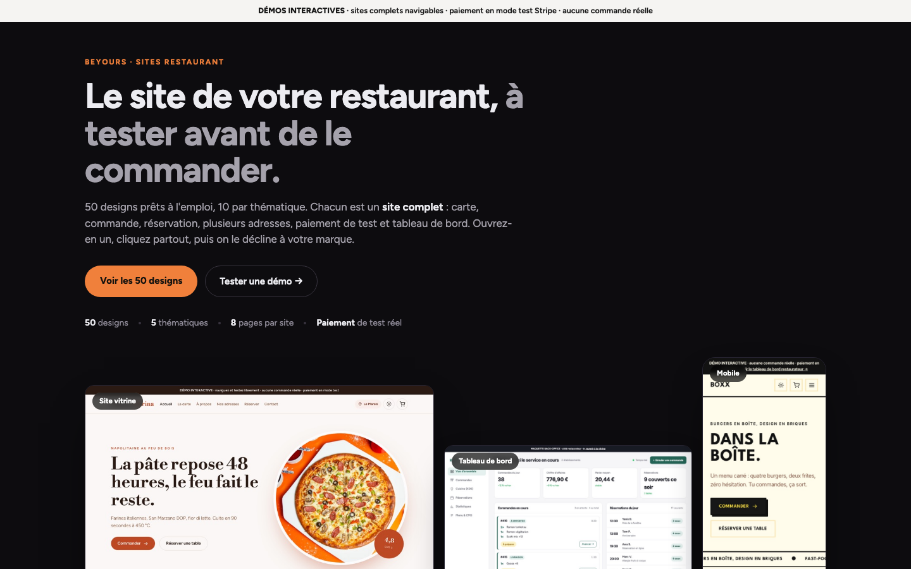
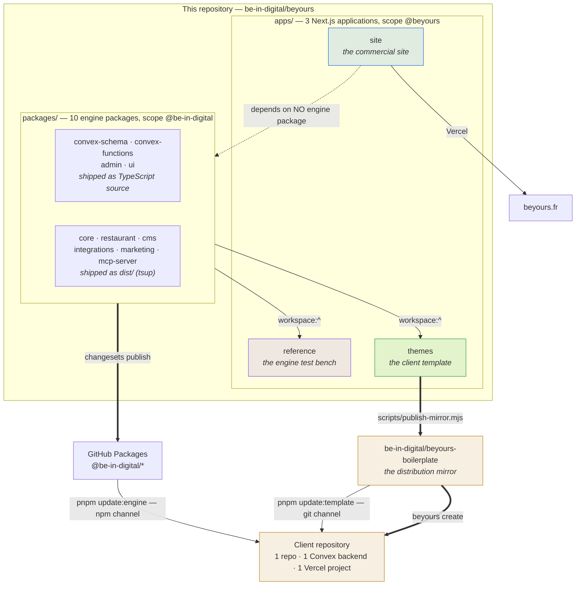
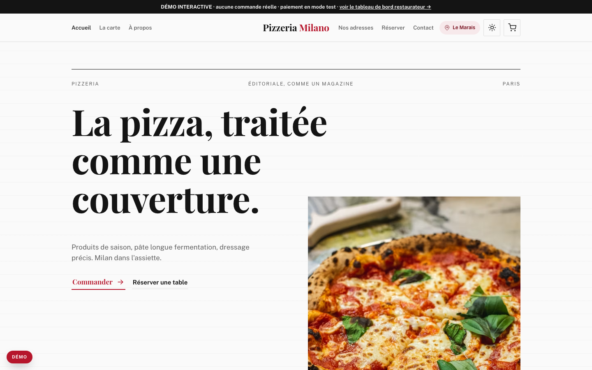
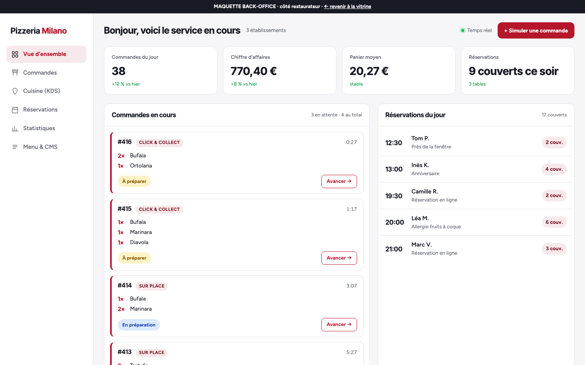
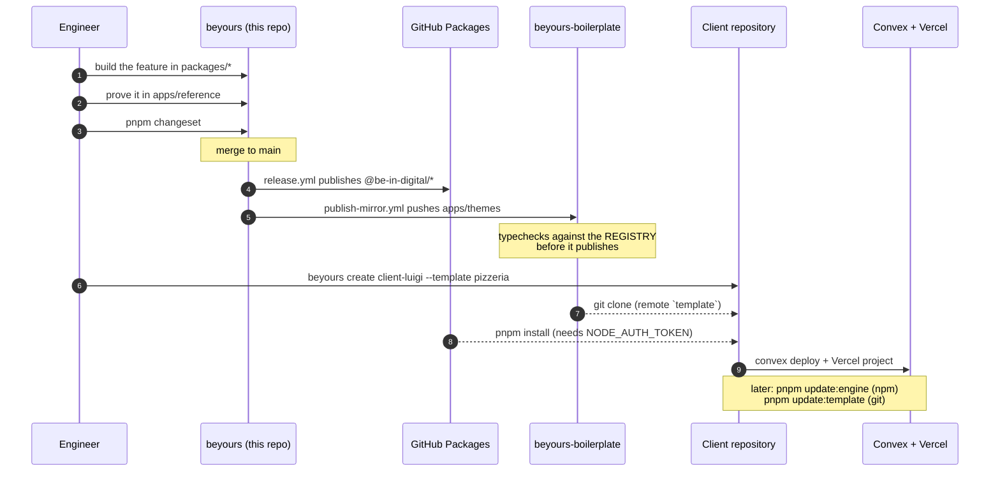
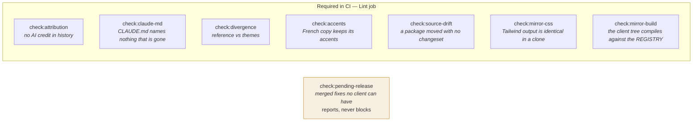
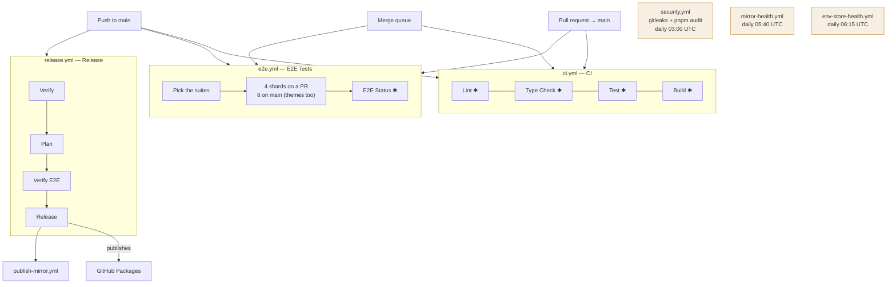
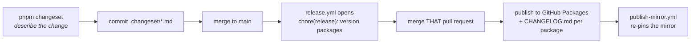

# BeYours

Everything that makes up the **BeYours** restaurant offering: the site that
sells it, the engine that runs it, and the template that ships it to each
client.

pnpm + Turborepo monorepo. Next.js 16 · React 19 · Convex · strict TypeScript.

**Live: https://beyours.fr**



> **BeYours is the product sold to restaurant owners. BeInDigital is the
> agency.** Two brands, two businesses. The rule and its exceptions are spelled
> out under [Naming](#naming-what-gets-renamed-and-what-never-does) — read it
> before any find-and-replace.

> **About the numbers in this file.** Every count below was measured on
> **2026-09-10, at commit `f6c33c3`**, and is true of that tree and no other.
> The commands that produced each one are given, so you can re-run them rather
> than trust them. A figure with no commit attached is not a measurement —
> if you update a count, move the date with it.

---

## In one minute

| | |
| --- | --- |
| **What we sell** | A turnkey online ordering site for restaurants, with no commission on direct sales |
| **Model** | One-off sale + 1 year of maintenance included, then annual renewal |
| **Multi-location** | 1 owner = 1 to N locations, unlimited |
| **How we sell it** | 50 browsable demos, real cart, Stripe test payments — prospects try before they buy |
| **How we ship it** | 1 repository and 1 Convex backend per client, cloned from `apps/themes` |
| **Who brings clients** | Independent affiliates, contract signed online, commissions tracked |

---

## The whole system on one page

Three applications, ten packages, one registry, one mirror, N client sites.
Nothing else in this repository is load-bearing.



Read that diagram in two passes. **Solid arrows are code moving**; the dotted
one is the fact that surprises everybody: `apps/site` consumes none of the
engine. It is a website that sells the product, not an instance of it.

---

## The three applications

This is the first thing to understand: the repository holds **three distinct
Next.js applications**. They deploy to different places and serve different
audiences.

| App | Workspace | Audience | Where it runs |
| --- | --- | --- | --- |
| [`apps/site`](apps/site) | `@beyours/site` | Prospects, affiliates, internal team | Vercel → **beyours.fr** |
| [`apps/reference`](apps/reference) | `@beyours/reference` | Nobody — it is the engine's test bench | Local / preview |
| [`apps/themes`](apps/themes) | `@beyours/themes` | Each client restaurant, after cloning | Vercel, 1 project per client |

**`apps/site` — the commercial site.** Marketing pages, a catalogue of 52
templates, the Stripe checkout, the affiliate portal and the internal operations
console, across 37 page routes and 1 route handler. It depends on **none** of
the engine packages, and it has its own Convex backend, separate from the
engine's.

**`apps/reference` — the reference application.** 109 page routes and 6 route
handlers wiring all ten packages together: storefront, admin dashboard, CMS,
kitchen display, QR games. This is where an engine feature is built and proven
before it is published. It is sold to nobody.

**`apps/themes` — the client template.** The shippable counterpart of
`apps/reference` — 109 page routes, 9 route handlers — plus everything the
engine cannot carry: the client zone, the 51 design templates, the
site-creation scripts, the 50 sales demos.

```bash
# re-measure the route counts
find apps/<app>/app -name 'page.tsx' | wc -l
find apps/<app>/app -name 'route.ts' | wc -l
```





### `reference` and `themes` are near-identical twins

That is deliberate, and it is guarded. A feature is proven on the bench and
shipped on the template, so every file that differs between them is either a
recorded decision or a fix that landed on one side only — which is a defect in
whichever side missed it.

`pnpm check:divergence` fails on any undocumented difference. The recorded ones
live in [`tasks/reference-themes-divergence.md`](tasks/reference-themes-divergence.md),
and a divergent file must also say so in a comment. The pass of 2026-08-29 cut
70 differing shared files to 19; ten pull requests later there were 20 again,
and the regression — a function added to the bench and not to the template —
was found by hand, ten pull requests late. Hence the guard.

> **Corollary for anyone deleting code in `apps/themes`:** "nothing imports it"
> does not prove "removable" there. The template carries deliberate dead code
> for the client zone. Read the divergence document first.

---

## A push only builds what it touches

This is why the repositories were merged. Each app carries its own
`vercel.json`:

```json
{ "ignoreCommand": "npx turbo-ignore @beyours/<app>" }
```

Turbo follows the **dependency graph**, not the directory tree:

| What you change | site | reference | themes |
| --- | --- | --- | --- |
| `apps/site/**` | ✓ builds | ⏭ skipped | ⏭ skipped |
| `packages/ui/**` | ⏭ skipped | ✓ builds | ✓ builds |
| `apps/themes/**` | ⏭ skipped | ⏭ skipped | ✓ builds |

The site is spared by a change in `packages/ui` because it does not depend on
it — and only the graph knows that. A path-based rule would not have guessed.

⚠️ A change at the **root** (`package.json`, `pnpm-lock.yaml`, `turbo.json`)
invalidates everything, by construction. That is correct, but it means a
dependency bump rebuilds all three apps.

⚠️ **`turbo.json` declares no `env` for most tasks.** A variable that is not
`NEXT_PUBLIC_`-prefixed and is not listed in a task's `env` or `passThroughEnv`
**never reaches that task**. Adding an environment variable means adding it
there too, or it will be silently absent at build and at `test:e2e`.

---

## Layout

```
apps/
  site/          Commercial site — marketing, catalogue, checkout, affiliates, console
  reference/     The engine's reference application
  themes/        The site shipped to clients — app + 51 templates + 50 demos
  docs/          38 markdown pages of product documentation (not a workspace)

packages/        The 10 published packages — see below

scripts/         Repository-level tooling: guards, mirror, Infisical, git hooks
.github/         7 workflows
.githooks/       Tracked git hooks; `pnpm install` points core.hooksPath here
.changeset/      Package versioning (the three apps are excluded)
_project/        Historical architecture and design notes
tasks/           Runbooks: Uber Eats go-live, secret rotation, production audit
docs/captures/   Screenshots used by this README
```

Four companion documents sit beside this one, and
[`pnpm check:claude-md`](#the-guards) fails the build if any of them disappears:

| Document | Answers |
| --- | --- |
| [`ARCHITECTURE.md`](ARCHITECTURE.md) | The three apps, the ten packages, how a client site is cloned and updated |
| [`FEATURES.md`](FEATURES.md) | Every feature marked shipped, partial or not built — measured against `apps/themes`, not against the sales page |
| [`TESTING.md`](TESTING.md) | What the suites cover, what CI runs, how to measure coverage and why no threshold is enforced |
| [`DEPLOYMENT.md`](DEPLOYMENT.md) | Vercel and Convex per client, the env tiers a deployment refuses to boot without, the rollback path |
| [`CLAUDE.md`](CLAUDE.md) | The working agreement: conventions, guards, and the facts that are easy to get wrong |

---

## The engine packages

Ten packages published to **GitHub Packages** under the `@be-in-digital/*`
scope, versioned together by changesets. Sizes exclude tests.

| Package | Contents | Files | Lines | Shipped as | Version |
| --- | --- | ---: | ---: | --- | --- |
| [`convex-functions`](packages/convex-functions) | Convex backend functions — 96 modules | 96 | 33,353 | **TS source** | 7.0.1 |
| [`admin`](packages/admin) | Administration pages, components, stores, hooks | 215 | 43,127 | **TS source** | 15.0.1 |
| [`core`](packages/core) | Auth, i18n, AWS (S3/SES), env, email, Sentry | 44 | 9,812 | `dist/` (tsup) | 4.1.0 |
| [`ui`](packages/ui) | React components, design system, contrast tooling | 71 | 8,501 | **TS source** | 4.3.1 |
| [`convex-schema`](packages/convex-schema) | Convex tables, validators, types | 44 | 7,177 | **TS source** | 6.2.0 |
| [`integrations`](packages/integrations) | Uber Eats, Deliveroo, Uber Direct | 27 | 4,082 | `dist/` | 2.2.2 |
| [`restaurant`](packages/restaurant) | Business logic, hooks, Zustand stores | 23 | 2,718 | `dist/` | 4.1.1 |
| [`mcp-server`](packages/mcp-server) | MCP server exposing the package registry | 4 | 1,902 | `dist/` | 1.1.4 |
| [`marketing`](packages/marketing) | Email campaigns, segments, subscribers | 7 | 1,717 | `dist/` | 3.0.0 |
| [`cms`](packages/cms) | Block registry, validation, sanitisation | 9 | 982 | `dist/` | 3.1.0 |

```bash
# re-measure a package
find packages/<name>/src \( -name '*.ts' -o -name '*.tsx' \) \
  -not -path '*__tests__*' -not -name '*.test.*' | wc -l
```

### Four packages ship as raw TypeScript

`convex-functions`, `convex-schema`, `admin` and `ui` point their `main` at
`./src/index.ts`. This is deliberate: the schema and functions must be read by
the client's own Convex compiler, and `admin` carries Server Components that
transpiling would break.

**Practical consequence: those four have no `build` task.** A type error in
them surfaces only during `type-check`, or in the build of an app that consumes
them — never in their own package.

```bash
# which packages build, and what their entry point is
for p in packages/*/; do
  node -e "const d=require('./$p/package.json');
    console.log(d.name.padEnd(34), ('build' in (d.scripts||{})) ? 'build' : '  --  ', d.main)"
done
```

> This table used to say three packages, and list `ui` as shipping `dist/`.
> `packages/ui/package.json` has no `build` script and its `main` is
> `./src/index.ts`. Corrected 2026-09-10 by running the loop above.

### The scope stays `@be-in-digital`

The repositories were renamed to `beyours-*`; the npm scope was not. Changing it
would break every client site on its next install. So it remains
`@be-in-digital/*` — a registry identifier, not a brand name.

The three apps use the other scope, `@beyours/*`. Two scopes, deliberately.

---

## How a client site comes to life



Creating a site, from a terminal:

```bash
beyours create client-luigi --name "Chez Luigi" --template pizzeria --repo be-in-digital/client-luigi
```

The command chains clone → `template` remote → private repo creation →
`pnpm install` → configuration (`site.config.ts`, secrets, `.env.local`) →
initial commit → push. Details in
[`apps/themes/README.md`](apps/themes/README.md).

It is also runnable without cloning anything first:

```bash
gh api repos/be-in-digital/beyours-boilerplate/contents/scripts/create-site.mjs \
  -H "Accept: application/vnd.github.raw" \
  | node --input-type=module - client-luigi --name "Chez Luigi" --mobile
```

### The distribution mirror

Clients do not clone this repository but
**`be-in-digital/beyours-boilerplate`**, because a client site cannot clone a
subdirectory of a monorepo: git clones whole repositories. The mirror is the
shippable cut.

[`scripts/publish-mirror.mjs`](scripts/publish-mirror.mjs) pushes to it, fixing
the four things that only make sense here:

| | In `apps/themes` | In the mirror |
| --- | --- | --- |
| Engine dependencies | `workspace:^` | `^2.0.2` — whatever is published |
| Lockfile | the root one | its own, regenerated |
| `vercel.json` | `turbo-ignore` | absent — no turbo workspace on the client side |
| `name` | `@beyours/themes` | `beyours-boilerplate` |

`.github/workflows/publish-mirror.yml` triggers on two events, because the
mirror can drift in two ways: a template change (push to `main` touching
`apps/themes/**`) and a package republication (end of the *Release* workflow).
`workflow_dispatch` allows an on-demand dry run.

Locally:

```bash
NODE_AUTH_TOKEN=<PAT read:packages> node scripts/publish-mirror.mjs --check
```

Either way the sync **compiles before it publishes**: it stages the mirror in a
sandbox, installs the engine packages from the registry at the versions it is
about to pin, and runs the template's own `pnpm typecheck`. A red one refuses the
sync, because this repository's required checks build `apps/themes` against
`packages/*` at HEAD and a client installs something else entirely. `--check`
takes that gate too, so the dry run also installs the template. While the
published engine is behind, the refusal holds for *every* template change, not
only the one that outran the release — cut the release
(`pnpm check:pending-release`) rather than skipping it. See
[`DEPLOYMENT.md`](DEPLOYMENT.md#6-the-distribution-mirror).

⚠️ The mirror is rebuilt in full on every run: **a commit made directly on it
disappears**. Its history, however, is preserved — never a force-push, because
every client site has a `template` remote pointing at it and merges from it.

Required secret: `MIRROR_PUSH_TOKEN`, a fine-grained PAT with `contents: write`
on `beyours-boilerplate`. Without it the job runs as a dry run and reports drift
without pushing — `GITHUB_TOKEN` is scoped to the current repository only.

> **A new subpath in a package breaks the boilerplate before it fixes it.** The
> mirror pins the **published** version, not the workspace one. Export a new
> `./subpath` from `core` or `admin`, consume it in `apps/themes` on the same
> commit, and the mirror typecheck fails against a registry that does not have
> it yet. Cut the release first.

### Two update channels, never just one

| Channel | Command | What it carries |
| --- | --- | --- |
| **npm** | `pnpm update:engine` | Business logic — the `@be-in-digital/*` packages, by semver |
| **git** | `pnpm update:template` | The application shell — routes, Convex wrappers, scripts, configs |

They are separate because they move at different speeds: a logic fix spreads
through a version bump, a new route requires a git merge. A site can take one
without the other.

---

## The maintenance model

The site is sold once, with **one year of maintenance included**, then renewed
annually. While the contract is covered, the client receives every update. Once
it expires, their deployment **stays frozen on the last release published before
`coveredUntil`**, and they can request a full migration of the site to the host
or team of their choice.

The logic lives in
[`packages/convex-functions/src/maintenance.ts`](packages/convex-functions/src/maintenance.ts):

```ts
export function isReleaseCovered(contract, releasedAt) {
  return releasedAt <= contract.coveredUntil
}
```

⚠️ **The freeze is not enforced client-side.** `update-template.mjs` runs a bare
`git fetch template`: nothing checks the contract before pulling commits. An
expired site that runs the command gets everything. The business model is
written; its guard is not.

### There is no plan gating anywhere in the engine

Two offers are sold — **Essentielle** and **Premium** — and the engine never
learns which one was bought. No plan literal, no `planSlug`, no entitlement read
in `apps/themes/convex` or `packages/*/src`.
`apps/site/convex/planAvailability.ts` decides which plan may be **bought**, not
what a bought plan unlocks.

Do not write copy that implies a feature is withheld from a tier. If gating is
ever wanted, `maintenanceContracts` is the right home: one singleton row per
deployment, written by the team, read-only for the client.

### A delivered site never invents its own social proof

There is no `reviews` table and no `ratings` table, so nothing in the product
can produce a star. Never ship a hard-coded testimonial, rating, review count or
customer count in `apps/themes` — not even as a placeholder a client is
"expected to overwrite". A figure about an establishment is the establishment's
to state.

Held by `tests/storefront/no-fabricated-social-proof.test.ts` in both apps.

---

## Naming: what gets renamed, and what never does

Three levels, not to be confused:

| | |
| --- | --- |
| **BeYours** | The restaurant product. Interfaces, emails, demos, documentation |
| **Be in Digital** | The agency's registered trade name, operated by the company |
| **TUUM AGENCY SAS** | The legal entity — SIREN 930 817 697, RCS Paris |

**Never run a global find-and-replace.** These occurrences of `beindigital` must
survive:

| Identifier | Why it does not move |
| --- | --- |
| `@be-in-digital/*` | npm registry scope — changing it breaks every client site |
| `.beindigital-site.json` | Init sentinel present in every deployed site |
| `beindigital-addresses` · `beindigital-favorites` | `localStorage` keys — renaming them wipes end customers' addresses and favourites |
| `beindigital-email-tracking` | A Configuration Set that exists in AWS SES |
| `integrator_brand_id: "beindigital"` | Identifier registered with Uber Eats |
| `utm_source=beindigital` | Unsplash attribution must match the registered app name |
| `com.beindigital.<slug>` | Bundle identifier — frozen once the app is published to the stores |
| `beindigital.fr` | The domain does belong to the agency |

And **`apps/site` is out of scope**: "Be in Digital" is the trade name that
affiliate contracts are **already signed** against, and clause 5.2 forbids
altering it. Everything flows from
[`apps/site/lib/legal/company.ts`](apps/site/lib/legal/company.ts) — never
duplicate that information elsewhere.

### Language

Everything that lands on GitHub or in Git is written in **English**: commit
messages, branch names, issue and pull request titles and bodies, repository
documentation, code comments, test names, error strings thrown by engine code.

The exception is **French when French is the product**, and it is not to be
translated:

- customer-facing copy — storefront strings, CMS content, email templates,
  `apps/site` marketing copy
- legal and contractual text — CGV, mentions légales, RGPD notices, invoices.
  French is a legal requirement here, not a habit
- French domain terms quoted inside an English sentence, where translating
  would lose precision: *établissement*, *apporteur d'affaires*, *régime de
  TVA*, SIRET
- fixtures, seeds and test data that mimic real French restaurant content

`pnpm check:accents` guards that French copy against silent de-accenting, in
both twin apps at once.

### Never credit an assistant in Git

No `Co-Authored-By` trailer naming an assistant, no "generated with" line, no
robot emoji used as a signature — in commit messages, branch names, pull
request bodies, issue text, tag messages or release notes. The author of a
commit is the person who made it.

This is executed, not merely written:

- `.githooks/commit-msg` strips the trailers as they are written. `pnpm install`
  installs it by pointing `core.hooksPath` at that **tracked** directory.
- `pnpm check:attribution` refuses them in the required `Lint` job, over every
  commit between the event's base and `HEAD`.

> It was prose for months, and the cost was measured: 17 of the 24 commits in
> `4e625bde..3a6cb8d1` carry one, permanently, because `core.hooksPath` pointed
> at husky's `.husky/_` — a directory husky gitignores, so it was absent from
> every fresh clone and every linked worktree. Git runs no hook and says nothing
> when its hooks path resolves to nothing.

---

## Getting started

```bash
pnpm install
```

Requires **Node 20+** and **pnpm 10.4.1** (pinned in `packageManager`).

No `NODE_AUTH_TOKEN` is needed here: inside the monorepo the apps consume the
packages through `workspace:^`, not from the registry. The token is only
required in a **client repository**, which installs from GitHub Packages.

```bash
pnpm dev:site          # commercial site
pnpm dev:reference     # reference application
pnpm dev:themes        # client template
```

Apps with a Convex backend need a second terminal (`npx convex dev` from the app
directory). Each app documents its own startup:

- [`apps/site/README.md`](apps/site/README.md)
- [`apps/reference/README.md`](apps/reference/README.md)
- [`apps/themes/README.md`](apps/themes/README.md)
- [`apps/docs/`](apps/docs) — 38 pages: product guides, API reference, deployment

### Working in a worktree

`pnpm install` per worktree, always. A worktree shares the git object store, not
`node_modules`. Three failure modes look exactly like a bug in your code:

| Symptom | Actual cause |
| --- | --- |
| Imports resolve to nothing | `node_modules` was never installed in this worktree |
| A package change has no effect in the browser | The six `dist/` packages are consumed **built** — run their `build` |
| A build is green having compiled nothing | Turbo restored another worktree's cache |

For the third: read the `Tasks:` summary line at the end of a turbo run, not the
scrolling output. A log read mid-run is not a result.

---

## Command reference

Everything below is a script that exists in a `package.json` in this repository.
Run root-level commands from the repository root.

### Development

| Command | Effect |
| --- | --- |
| `pnpm dev` | `turbo run dev` — every app that declares a `dev` task |
| `pnpm dev:site` | `apps/site` only |
| `pnpm dev:reference` | `apps/reference` only |
| `pnpm dev:themes` | `apps/themes` only |
| `pnpm build` | `turbo run build`, in dependency-graph order |
| `pnpm clean` | `turbo run clean`, then removes the root `node_modules` |

`apps/site` and `apps/reference` wrap their own `dev` in the Infisical bootstrap
(`--optional`, so it degrades to a plain `next dev` when the store is not
reachable). `pnpm dev:plain` in either app skips the wrapper entirely.

### Quality

| Command | Effect |
| --- | --- |
| `pnpm lint` | ESLint across every workspace |
| `pnpm type-check` | `tsc --noEmit` across every workspace. In the three apps it runs **twice** — once for the app, once for `convex/tsconfig.json` |
| `pnpm format` | Prettier, writing in place |
| `pnpm format:check` | Prettier, read-only |

⚠️ **`pnpm format` would rewrite most of the repository.** The committed style
and the Prettier configuration disagree, so a red `format:check` is usually
about the repository, not about your change. Do not "fix" it in passing.

The second `tsc` pass over `convex/tsconfig.json` is the only safety net under
`convex/` — the app's own pass does not cover it.

### Tests

| Command | Effect |
| --- | --- |
| `pnpm test` | Vitest, every workspace |
| `pnpm test:coverage` | Vitest with coverage; writes `coverage/` per package |
| `pnpm test:ui` | Vitest UI — `apps/reference` only (one server per project) |
| `pnpm test:e2e` | Playwright, every workspace that declares it |
| `pnpm test:e2e:ui` | Playwright UI mode, `apps/reference` |
| `pnpm test:e2e:debug` | Playwright inspector, `apps/reference` |

For any other workspace, name it:
`pnpm --filter @be-in-digital/core test:coverage`,
`pnpm --filter @beyours/themes test:e2e:debug`.

Suite sizes at `f6c33c3`:

| Location | Vitest files | Playwright specs |
| --- | ---: | ---: |
| `packages/**` | 195 | — |
| `apps/reference` | 156 | 57 |
| `apps/themes` | 146 | 57 |
| `apps/site` | 58 | 1 |

**Coverage is measured on demand, never gated.** No config sets a threshold and
no workflow runs `test:coverage`. A run on 2026-09-05 had two of the nine engine
packages clearing 80% of statements, and the lowest at 4%. Measure before
quoting a number, and read [`TESTING.md`](TESTING.md) before adding a threshold.

### The guards

Eight scripts that fail on a condition no compiler and no test suite can see.
Each exists because the thing it checks went wrong once, silently.



| Command | Fails when | Flags |
| --- | --- | --- |
| `pnpm check:attribution` | A commit in the range carries AI attribution | — |
| `pnpm check:claude-md` | `CLAUDE.md` names a command that does not run, or a document that does not exist | — |
| `pnpm check:divergence` | `apps/reference` and `apps/themes` differ on a shared file with no recorded decision | — |
| `pnpm check:accents` | French user-facing copy lost its accents in either app | — |
| `pnpm check:source-drift` | A package's source moved since its last version bump and no changeset will move it again | `--warn-only`, `--no-registry`, `--fail-waiting` |
| `pnpm check:mirror-css` | `apps/themes`'s stylesheet differs between here and a client clone | — |
| `pnpm check:mirror-build` | The shippable cut does not typecheck against the engine packages **as tarballs** | — |
| `pnpm check:pending-release` | Never — it reports, and annotates once a changeset has waited too long | `--max-age-days N`, `--fail` |

Two of them deserve their reasoning spelled out.

**`check:mirror-css` exists because a source glob that matches nothing is not an
error.** `apps/themes/app/globals.css` reaches the engine packages through
Tailwind `@source` globs written relative to the *monorepo* root. The mirror
ships that file verbatim to a repository where `apps/themes` **is** the root, so
the globs resolved above it and matched nothing — silently. Measured at Tailwind
4.2.2: 3,102 rules here, 2,526 in a client clone.

**`check:mirror-build` exists because nothing else compiles the published
shape.** CI builds `apps/themes` through the pnpm workspace link, against
`packages/*` at HEAD. A client installs what the registry holds. Those are
routinely different code. `check:mirror-css` does materialise the client tree,
but it assembles `node_modules` by *symlinking* `packages/<name>` — so it never
sees a pinned version either.

### Environment and the secret store

The store is Infisical, project `beyours-platform`, environments `dev` /
`staging` / `prod`, five folders each. `scripts/infisical-bootstrap.mjs` is the
one entry point, and **it never prints, logs or stores a secret value** — it
works on key names only.

| Command | Effect |
| --- | --- |
| `pnpm env:check` | Ask the store whether each folder matches its spec |
| `pnpm env:plan` | Print the commands that would fill the gaps — it does not run them |
| `pnpm env:seed` | Push values into a folder |
| `pnpm dev:site:env` | `pnpm dev:site` with `/site` injected |
| `pnpm dev:reference:env` | `pnpm dev:reference` with `/reference` injected |
| `pnpm dev:themes:env` | `pnpm dev:themes` with `/themes` injected |
| `pnpm dev:demo:env` | `pnpm dev:themes` with `/demo` injected |

`env:check` distinguishes its two failures in its exit code, which is the whole
reason the daily health workflow can say something useful:

| Exit | Meaning | Consequence |
| ---: | --- | --- |
| `0` | Every folder complete | — |
| `1` | The store answered; its contents do not match the specs | A backlog item, not an outage. The job stays green with a warning |
| `3` | The store, or the session, is down | An incident: the chain that propagates a rotated credential is broken |

Local development needs `infisical login` once per machine, and nothing else.
CI uses the machine identity `infra-ci` (Universal Auth, org role `no-access`,
project role Viewer).

> **`infra-ci` carries two different UUIDs and they are not interchangeable.**
> The *identity ID* appears in the dashboard URL; the *Universal Auth client ID*
> is what `INFISICAL_CLIENT_ID` must hold. Infisical returns the same
> `401 Invalid credentials` for a wrong client ID as for a revoked secret, so
> the error does not say which. The identity's own page does — `Last Used` and
> the client secret's use count. A credential that has never been accepted
> cannot have expired. Both values are in
> [`apps/docs/deployment/infisical.md`](apps/docs/deployment/infisical.md).

⚠️ **Order matters when rotating.** The store first, the rest after.
`setup-convex-env.sh --infisical` treats Infisical as the source of truth and
overwrites what was changed elsewhere — a value rotated on a deployment but not
in the store is undone at the next provisioning, silently, with a green summary.

### Releasing

| Command | Effect |
| --- | --- |
| `pnpm changeset` | Declare a package change — required to publish |
| `pnpm version-packages` | `changeset version` — applies pending changesets |
| `pnpm release` | `turbo run build && changeset publish` |

### Client-site lifecycle — `apps/themes`

These run inside a client repository, or inside `apps/themes` here. Prefix with
`pnpm --filter @beyours/themes` from the root.

| Command | Effect |
| --- | --- |
| `pnpm setup` | Interactive site initialisation. Idempotent — `.beindigital-site.json` marks a site as done; `--force` re-runs it |
| `pnpm create:site <slug>` | One-shot: clone, configure, create the private repo, install, commit, push |
| `pnpm add:mobile` | Copy `.template/mobile/` to `mobile/`, write `app.json`, `mobile/.env`, `eas.json`. Refuses to overwrite an existing `mobile/` |
| `pnpm template:list` | Catalogue of the 51 design templates |
| `pnpm template:apply <slug>` | Apply a template. `default` restores the original theme |
| `pnpm update:engine` | npm channel. `--latest` crosses majors (breaking), `--check` prints versions and changes nothing |
| `pnpm update:template` | git channel. `--dry-run` lists the commits, `--first` handles a repo made with "Use this template" |
| `pnpm engine:link [path]` | Consume `@be-in-digital/*` from a local clone instead of the registry — no `NODE_AUTH_TOKEN` needed |
| `pnpm engine:unlink` | Undo the above |
| `pnpm env:setup` | Wizard: required variables, then integrations |
| `pnpm env:check` | Verify the three env files agree |
| `pnpm env:sync` | Propagate `.env.local` into `.env.convex` and `mobile/.env` |
| `pnpm convex:env` | Push the Convex-side variables onto the deployment in `.env.local` (or `--prod`) |
| `pnpm convex:env:infisical` | Same, reading Infisical as the source of truth |
| `pnpm convex:dev` · `pnpm convex:deploy` · `pnpm convex:codegen` | Convex CLI passthrough |
| `pnpm ses:check` | Is this deployment out of the SES sandbox yet? |

Three env files, one source of truth:

```
.env.local     Next.js web     ← the source of truth
.env.convex    Convex backend  ← shared subset, pushed by `pnpm convex:env`
mobile/.env    Expo app        ← EXPO_PUBLIC_CONVEX_URL
```

`.env.convex` holds **per-client** values — the restaurant's own AWS keys, its
Stripe account, its Deliveroo brand and site ids. One file per client
repository, gitignored, shared with nobody.

⚠️ **`pnpm ses:check` answers a question that cannot be answered on go-live
day.** A new AWS account starts in the SES *sandbox*: mail reaches only
addresses you verified yourself, capped at 200 a day. A restaurant that opens in
the sandbox takes orders and confirms none of them, and nothing errors visibly —
SES simply refuses the send. Leaving the sandbox is a request AWS reviews by
hand.

### Adding a Convex module

Convex codegen requires a live deployment, which a fresh checkout does not have.
When you add a module under `convex/`, add its two lines to `convex/_generated/api.d.ts`
**by hand, in the exact existing format, in both apps** — `apps/reference` and
`apps/themes`. Otherwise the module is invisible to `tsc` and the twin
divergence guard.

---

## CI

Seven workflows. Five checks block a merge; the rest report.



✱ = required to merge.

| Workflow | What it does |
| --- | --- |
| `ci.yml` | `Lint` · `Type Check` · `Test` · `Build`, on pull requests, pushes to `main`, and the merge queue |
| `e2e.yml` | Playwright, sharded. Four shards on a pull request, eight on `main` — where the client template's suite runs too. No gate and no `E2E_*` secrets: **each shard starts its own Convex backend** |
| `release.yml` | changesets — `Verify` → `Plan` → `Verify E2E` → `Release` |
| `publish-mirror.yml` | Pushes `apps/themes` to the distribution mirror |
| `security.yml` | gitleaks over full history + `pnpm audit`, plus a daily run at 03:00 UTC |
| `mirror-health.yml` | Daily at 05:40 UTC — is the mirror current? Opens or comments on one issue |
| `env-store-health.yml` | Daily at 06:15 UTC — does the Infisical store still answer? Opens or comments on one issue |

### The five required checks

`main` requires `Lint`, `Type Check`, `Test` and `Build` — the four job names
from `ci.yml` — plus `E2E Status` from `e2e.yml`.

Since 3 September 2026 the protection is a **ruleset**, not classic branch
protection, so `GET /branches/main/protection` answers `404 Branch not
protected` while the branch is very much protected. Read the rules at
`/rules/branches/main`. No approving review is required, and admins can bypass.

*Require branches to be up to date* is **off**. A merge queue builds the
prospective merged state and runs these same checks against it, which is the
same guarantee without asking every author to rebase behind every merge.

**The required E2E check is `E2E Status`, never `E2E Tests`.** `E2E Status` is a
one-step aggregate over every shard and report job, and it fails on anything
that is not a real pass — `failure`, `cancelled` and `skipped` alike. Requiring
a *shard* instead would be the old trap: a job that does not run reports
`skipped`, and GitHub counts a skip as satisfied.

That is also why the client template's E2E job must never be required directly.
Its suite is deliberately degraded for clients, and requiring the job rather
than the aggregate would make a skip look like a pass.

Deliberately **not** required: the two `security.yml` checks — a new advisory in
an untouched dependency would block unrelated merges. The reasoning behind each
choice is `tasks/ci-required-checks-runbook.md` §5–§6.

### Reading a red CI honestly

| Signature | What it actually means |
| --- | --- |
| Every job dies in ~3 seconds with `steps: []` | **Billing**, not a defect. The Free plan's Actions minutes ran out. Settle it, then `gh run rerun <id>` — do not push an empty commit |
| A stacked pull request shows zero required checks | Its base is not `main`. Vercel will still show a green mark; the engine's CI never ran |
| The engine CI is green but a `themes` spec was never executed | `ci.yml`'s E2E target is `reference`. A spec written only in `themes` ships without ever running on a pull request |
| Vitest times out under load | A saturated machine, not a regression. Measure alone, and compare against a clean `main` |
| A turbo task is green having produced nothing | A cache hit from another worktree. Read the final `Tasks:` line |

While CI is unavailable, verify locally: `pnpm lint`, `pnpm type-check`,
`pnpm test`, `pnpm build`.

---

## Publishing the packages



1. `pnpm changeset` — describe the change, pick patch / minor / major
2. Commit the generated file under `.changeset/`
3. Merge to `main`

The `release.yml` workflow then opens a "chore(release): version packages" pull
request. **Merging it publishes** to GitHub Packages and updates the
`CHANGELOG.md` files.

All three apps are excluded from versioning (`.changeset/config.json`): they are
not published, they are deployed.

⚠️ **The version bump is manual.** This organisation forbids Actions from
opening pull requests, so the release pull request may need to be created by
hand. `pnpm check:pending-release` prints what is merged here and on no client
site yet.

⚠️ **`admin` majors on a peer dependency.** A major bump there propagates
further than it looks — check what depends on it before releasing.

---

## Deployment

| Vercel project | Team | Source | Root Directory |
| --- | --- | --- | --- |
| `beindigital-restaurant` | `be-in-digital` | this repo, `main` branch → **beyours.fr** | `apps/site` |
| 1 project per client | `be-in-digital` | the client's cloned repository | root |

Convex is pushed separately, from the app directory: `npx convex deploy`. Each
client has **their own Convex deployment** — data isolation is a whole backend,
not a filter someone has to remember. No SQL database is involved anywhere.

### Convex deployments

The authoritative inventory. Re-measured 2026-09-01, after the cutover to the
dedicated company account **and** after the project transfer that finished it.

**Everything the product runs on is now on team `be-yours`.** The site's backend
got there by *transfer*, not by migration: the project moved teams, the
deployment did not move at all. Same `famous-wildcat-229`, same URLs, same env
vars, same data, same deploy keys — nothing was re-wired on Vercel or Stripe, and
the site served traffic throughout.

#### On `be-yours` — what runs the product

| Deployment | App | Role | Convex project |
| --- | --- | --- | --- |
| `famous-wildcat-229` | `apps/site` | **production** — beyours.fr | `beyours-commercial-site` |
| `hallowed-schnauzer-20` | `apps/site` | dev (`dev/mamadou-seck`) | `beyours-commercial-site` |
| `optimistic-swordfish-937` | `apps/reference` | **production** — the engine, incl. Stripe BID billing | `beyours-engine-reference` |
| `dusty-nightingale-945` | — | **empty and unused** — see below | `beyours-commercial-site` |
| `zany-barracuda-114` | `apps/themes` | **the shared demo backend** — one for every template's demo; not yet deployed | `beyours-client-template` |

#### Still on `momoseck8` — none of it serves anything

| Deployment | Former role | `/version` |
| --- | --- | --- |
| `robust-elephant-263` | former production of the engine | `200` |
| `fearless-poodle-133` | former production of beyours.fr | `200` |
| `capable-crocodile-720` | dev, `apps/site` | `200` |
| `reliable-parrot-452` | dev — personal (`dev/mamadou-seck`) | `200` |
| `youthful-goose-352` | stray dev | `200` |
| `happy-otter-123` | dead — caused bug #6 | `404` |

#### What a `200` does and does not prove

All five live deployments answer with the **identical** build stamp
(`20260824T183734Z-bd777bce25d6`) — including two that are definitively in
different projects. `/version` is served by the platform, not by your functions,
so:

- A `404` is a definite red: the name resolves to nothing.
- A `200` proves only that *some* live Convex backend answers on that subdomain.
  It does **not** prove the deployment is ours, which team it is on, which
  project it belongs to, or that its functions work.

The probe never filled in the Team and Convex project columns above — the
dashboard did.

#### One name, three systems — and only one of them was renamed

The Convex project holding `famous-wildcat-229` was called
`beindigital-restaurant` until 2026-09-01, when it was renamed to
**`beyours-commercial-site`**. Renaming a Convex project does not touch its
deployments: the URLs are unchanged and nothing was re-wired.

`beindigital-restaurant` still exists, and means two other things:

| Where | What it is |
| --- | --- |
| GitHub | the repository, `be-in-digital/beindigital-restaurant` |
| Vercel | the project that builds `apps/site` |
| ~~Convex~~ | **renamed** — now `beyours-commercial-site` |

A search for that name will keep returning hits. They are not stale; they are
about the other two systems.

#### Open items

- **`dusty-nightingale-945` is a redundant empty project.** Schema and 139
  functions deployed, **no documents at all**. Keeping it means a second empty
  project someone will mistake for production one day.
- **`zany-barracuda-114` has not been deployed to yet.** Every template's demo
  points at this one deployment, because a backend per design would be a
  deployment per colour scheme. A theme that is *sold* still gets its own
  repository and its own Convex deployment.
- **The six old deployments are still up.** Decommissioning them is
  [`tasks/convex-account-cutover-runbook.md`](tasks/convex-account-cutover-runbook.md) §4.
- **Delete the `beyours-reference` project** — decided 2026-08-28. It holds one
  stray dev deployment nothing depends on. Deleting a project deletes its
  deployments and their data, so confirm nobody's checkout is still linked to it
  (`npx convex env list` from `apps/reference` prints what it resolves to).

⚠️ **Convex spending caps apply per team, not per project.** Two production
backends on one team share a single disable threshold: one crossed takes down
the shop and the product together. Procedure in the
[spending-cap runbook](tasks/convex-spending-cap-runbook.md).

### AWS: one account per client is the decision, not yet the state

Every site provisioned before the change still holds the fleet-wide key and the
shared bucket, and therefore still carries credentials to other clients' data
([#199](https://github.com/be-in-digital/beyours/issues/199)). Moving one is a
migration — copy its S3 objects, create and verify its SES identity, re-point
stored URLs, rotate the shared key — not a config change.
`scripts/setup-aws.sh` with no `SITE_SLUG` provisions into the shared account
deliberately, and warns before it does.

### Rolling back

The Vercel project was reconnected to this repository on 2026-08-16.

**Fastest path, and the one to reach for first:** promote deployment
`dpl_5cZtp6nZ3j8e4Mzv7GQHtj12N9BQ` from the Vercel dashboard. That is the last
production build served from the old configuration — it restores the site
immediately, with no rebuild and no repository involved.

**Full path**, if the site has to keep deploying from the old repository:

```bash
gh repo unarchive be-in-digital/beyours                       # archived 2026-08-16
vercel project update beindigital-restaurant --auto-detect root-directory --scope be-in-digital
vercel git connect https://github.com/be-in-digital/beyours --scope be-in-digital
```

---

## Things to watch

**The site's demo storefront is a reimplementation.**
`apps/site/lib/template-storefront.ts` shares no code with `apps/themes`, the
product actually shipped. A prospect therefore tries something other than what
they buy, and the two drift apart with every change. This is the main open
architectural issue in the repository.

**The catalogue exists in three copies.** 52 entries in
`apps/site/lib/templates-data.ts`, 51 directories in `apps/themes/templates/`,
50 demos in `apps/themes/demos/`. Three lists that no test reconciles.

**A commit made directly on the mirror is lost.**
`be-in-digital/beyours-boilerplate` is rebuilt in full on every sync. All
changes belong here, in `apps/themes`.

**32 routes under `apps/reference/app/(admin)/` are redirects** to
`/dashboard/*`. They are historical aliases, not duplicates: do not try to merge
them.

**`apps/site`'s tests escape `tsc` and ESLint.** A fixture with the wrong type
passes green there. Manual verification of that app has its own false positives.

**Four repository names were freed by past renames** — `beindigital`,
`beindigital-engine`, `beindigital-boilerplate`, `beyours-engine`. Scripts in
production rely on the associated GitHub redirects. **Do not recreate any of
them**: creating a repository under one of those names silently destroys the
redirect.

---

## History

This repository was called `beindigital`, then `beyours-engine`, and is now
`beyours`. Until August 2026 it hosted the engine **and** both of the company's
websites.

The August 2026 split first moved the four projects into four repositories, then
regrouped the three that belong to BeYours — the site, the engine, the template
— into this one, with their full history (`git subtree`). `beyours-engine` was
then dropped as a name: the repository is no longer just the engine. The agency
site went its own way, to
[`beindigital.fr`](https://github.com/be-in-digital/beindigital.fr): different
brand, different business, no code dependency.

`be-in-digital/beyours-legacy-site` is the archived, read-only remains of the
standalone site repository. Its history is fully reachable here through
`apps/site`.

---

## Picking up the project

In order, arriving with no context:

1. This README, then [`apps/docs/getting-started/introduction.md`](apps/docs/getting-started/introduction.md).
2. [`CLAUDE.md`](CLAUDE.md) — the working agreement, and the list of facts that
   are easy to get wrong.
3. The [Naming](#naming-what-gets-renamed-and-what-never-does) section, before
   touching anything that carries a name.
4. `pnpm install && pnpm dev:reference` — the reference app is the shortest path
   to seeing the whole product run.
5. `packages/convex-schema/src/` for the data model,
   `packages/convex-functions/src/` for what acts on it.
6. Open `apps/themes/demos/index.html` in a browser: that is what a prospect
   sees, and it works offline.

---

**License** — Private. All rights reserved.
