# BeYours Engine - Features Diagram

> **This document counts features that were designed, not features that ship.**
> It is the origin of the "181+ features" headline, and that headline was wrong
> twice over: its own table below sums to **201**, and neither figure counts
> anything that was measured against the code. The audit of 1 September 2026
> went through the 92 features `CLAUDE.md` reproduces from this document and
> found **29 shipping as described, 23 partial, and 41 absent or unreachable**
> from `apps/themes` — the application a paying client actually runs.
>
> Several categories here also count things that are not features: six themes
> as six features, seven team roles as seven, six social-action types as six.
>
> Keep the diagram — it is a useful map of the intended product, and the
> "Feature Priority Levels" section at the end records honest phasing. Do not
> quote a total from it, in a proposal or anywhere else.

## Complete Features Overview

```mermaid
graph TB
    subgraph "BeYours Engine"
        Core[Core Platform]
        
        subgraph "1. Multi-Store Management"
            MS1[Store Configuration]
            MS2[Store Hours & Settings]
            MS3[Store Location & Geolocation]
            MS4[Multi-Store Dashboard]
            MS5[Store Status Management]
        end
        
        subgraph "2. Product & Menu Management"
            PM1[Product Catalog]
            PM2[Categories & Tags]
            PM3[Product Options & Variants]
            PM4[Pricing & Discounts]
            PM5[Allergen Management]
            PM6[Nutritional Information]
            PM7[Stock Management]
            PM8[Menu Scheduling]
            PM9[Image Gallery]
        end
        
        subgraph "3. Order System"
            OS1[Order Creation]
            OS2[Order Tracking]
            OS3[Order Status Management]
            OS4[Order History]
            OS5[Scheduled Orders]
            OS6[Order Types]
            OS7[Order Notifications]
            OS8[Order Analytics]
            
            OS6 --> OT1[Delivery]
            OS6 --> OT2[Click & Collect]
            OS6 --> OT3[Dine-In]
        end
        
        subgraph "4. Kitchen Display System KDS"
            KDS1[Real-time Order Display]
            KDS2[Priority Management]
            KDS3[Prep Time Estimation]
            KDS4[Multi-Station Support]
            KDS5[Sound Notifications]
            KDS6[Order Assignment]
            KDS7[Kitchen Analytics]
            KDS8[Platform Badge]
            KDS9[Auto-Print Tickets]
            KDS10[Manual Reprint]
            KDS11[Multi-Printer Support]
            KDS12[Printer Status Monitor]
        end
        
        subgraph "5. Payment Processing"
            PAY1[Stripe Integration]
            PAY2[SumUp Integration]
            PAY3[PayPal Integration]
            PAY4[Square Integration]
            PAY5[Cash Payments]
            PAY6[Payment Tracking]
            PAY7[Refund Management]
            PAY8[Invoice Generation]
        end
        
        subgraph "6. Third-Party Integrations"
            INT1[Uber Eats]
            INT2[Deliveroo]
            INT3[Uber Direct]
            
            INT1 --> UE1[Menu Sync]
            INT1 --> UE2[Order Import]
            INT1 --> UE3[Status Updates]
            INT1 --> UE4[Auto Accept Orders]
            
            INT2 --> DR1[Menu Sync]
            INT2 --> DR2[Order Import]
            INT2 --> DR3[Status Updates]
            INT2 --> DR4[Manual/Auto Accept]
            
            INT3 --> UD1[Delivery Request]
            INT3 --> UD2[Real-time Tracking]
            INT3 --> UD3[Driver Assignment]
        end
        
        subgraph "7. Customer Management"
            CM1[Customer Profiles]
            CM2[Order History]
            CM3[Preferences]
            CM4[Addresses]
            CM5[Favorite Products]
            CM6[Customer Segmentation]
            CM7[Customer Analytics]
            CM8[Communication History]
        end
        
        subgraph "8. Promotions & Discounts"
            PROMO1[Percentage Discounts]
            PROMO2[Fixed Amount Discounts]
            PROMO3[BOGO Offers]
            PROMO4[Free Shipping]
            PROMO5[Promo Codes]
            PROMO6[Automatic Discounts]
            PROMO7[Time-based Promotions]
            PROMO8[Minimum Order Promotions]
            PROMO9[First Order Discounts]
        end
        
        subgraph "9. Gamification & Interactive Games"
            GAM1[QR Code Table Stickers]
            GAM2[Action Requirements System]
            GAM3[Spin the Wheel Game]
            GAM4[Scratch Card Game]
            GAM5[Prize Management]
            GAM6[Winner Notification Email]
            GAM7[QR Code Prize Redemption]
            GAM8[24h Play Cooldown]
            GAM9[Analytics Dashboard]
            GAM10[Prize Inventory]
            
            GAM2 --> ACT1[Google Review]
            GAM2 --> ACT2[YouTube Subscribe]
            GAM2 --> ACT3[Instagram Follow]
            GAM2 --> ACT4[Facebook Like]
            GAM2 --> ACT5[TikTok Follow]
            GAM2 --> ACT6[Newsletter Subscribe]
            
            GAM3 --> GAME1[Wheel of Fortune]
            GAM4 --> GAME2[Scratch & Win]
        end
        
        subgraph "10. Email Marketing"
            EM1[Email Campaigns]
            EM2[Customer Segmentation]
            EM3[Email Templates]
            EM4[Campaign Scheduling]
            EM5[A/B Testing]
            EM6[Campaign Analytics]
            EM7[Automated Emails]
            EM8[Transactional Emails]
            
            EM7 --> AE1[Welcome Email]
            EM7 --> AE2[Order Confirmation]
            EM7 --> AE3[Order Ready]
            EM7 --> AE4[Abandoned Cart]
            EM7 --> AE5[Birthday Email]
        end
        
        subgraph "11. Custom CMS"
            CMS1[Page Builder]
            CMS2[Blog System]
            CMS3[FAQ Management]
            CMS4[Multi-language Content]
            CMS5[SEO Optimization]
            CMS6[Media Library]
            CMS7[Menu Pages]
            CMS8[Custom Forms]
        end
        
        subgraph "12. Team Management"
            TM1[User Roles]
            TM2[Permissions RBAC]
            TM3[Staff Accounts]
            TM4[Activity Logs]
            TM5[Shift Management]
            TM6[Performance Tracking]
            
            TM1 --> ROLE1[Super Admin]
            TM1 --> ROLE2[Client Admin]
            TM1 --> ROLE3[Manager]
            TM1 --> ROLE4[Kitchen Staff]
            TM1 --> ROLE5[Waiter]
            TM1 --> ROLE6[Delivery]
            TM1 --> ROLE7[Customer]
        end
        
        subgraph "13. Authentication & Security"
            AUTH1[Better Auth]
            AUTH2[Email/Password]
            AUTH3[Social Login]
            AUTH4[Two-Factor Auth]
            AUTH5[Session Management]
            AUTH6[Password Reset]
            AUTH7[Account Verification]
            AUTH8[Security Logs]
        end
        
        subgraph "14. Analytics & Reporting"
            AN1[Sales Analytics]
            AN2[Product Performance]
            AN3[Customer Insights]
            AN4[Revenue Reports]
            AN5[Traffic Analytics]
            AN6[Conversion Tracking]
            AN7[Order Source Analytics]
            AN8[Kitchen Performance]
            AN9[Custom Reports]
            AN10[Export Data]
        end
        
        subgraph "15. Internationalization i18n"
            I18N1[Dynamic Language Management]
            I18N2[Admin Add/Remove Languages]
            I18N3[Auto-Translation GPT-3.5]
            I18N4[Manual Translation Editor]
            I18N5[Bulk Translation Tool]
            I18N6[Translation Memory]
            I18N7[Currency Support]
            I18N8[Date/Time Formats]
            I18N9[RTL Support]
            I18N10[Language Toggle UI]
            
            I18N3 --> GPT[GPT-3.5-turbo API]
            I18N1 --> LANGS[Unlimited Languages]
        end
        
        subgraph "16. Design Customization"
            DC1[Theme Selection]
            DC2[Color Customization]
            DC3[Font Selection]
            DC4[Logo Upload]
            DC5[Banner Management]
            DC6[Layout Options]
            DC7[Custom CSS]
            DC8[Mobile Responsive]
            
            DC1 --> THEME1[Fast Food]
            DC1 --> THEME2[Pizzeria]
            DC1 --> THEME3[Chinese]
            DC1 --> THEME4[Fine Dining]
            DC1 --> THEME5[Café/Bakery]
            DC1 --> THEME6[Sushi Bar]
        end
        
        subgraph "17. Notifications System"
            NOT1[Push Notifications]
            NOT2[Email Notifications]
            NOT3[SMS Notifications]
            NOT4[In-App Notifications]
            NOT5[Admin Alerts]
            NOT6[Customer Alerts]
            NOT7[Kitchen Alerts]
        end
        
        subgraph "18. Reviews & Ratings"
            REV1[Product Reviews]
            REV2[Store Reviews]
            REV3[Rating System]
            REV4[Review Moderation]
            REV5[Response System]
            REV6[Review Analytics]
        end
        
        subgraph "19. Inventory Management"
            INV1[Stock Tracking]
            INV2[Low Stock Alerts]
            INV3[Auto-disable Products]
            INV4[Supplier Management]
            INV5[Purchase Orders]
            INV6[Stock History]
        end
        
        subgraph "20. Maintenance & Updates"
            MAINT1[Update Management]
            MAINT2[Version Control]
            MAINT3[Changelog]
            MAINT4[Maintenance Mode]
            MAINT5[Backup System]
            MAINT6[Rollback System]
            MAINT7[Update Notifications]
        end
        
        subgraph "21. AWS Services"
            AWS1[S3 Storage]
            AWS2[SES Email]
            
            AWS1 --> S3_1[Product Images]
            AWS1 --> S3_2[Branding Assets]
            AWS1 --> S3_3[Documents]
            AWS1 --> S3_4[CMS Media]
            
            AWS2 --> SES1[Transactional Emails]
            AWS2 --> SES2[Marketing Emails]
            AWS2 --> SES3[Notifications]
        end
        
        subgraph "22. Advanced Features"
            ADV1[Table Reservations]
            ADV2[QR Code Ordering]
            ADV3[Smart Recommendations]
            ADV4[AI Menu Optimization]
            ADV5[Predictive Analytics]
            ADV6[Voice Ordering]
            ADV7[AR Menu Preview]
        end
        
        Core --> MS1
        Core --> PM1
        Core --> OS1
        Core --> KDS1
        Core --> PAY1
        Core --> INT1
        Core --> CM1
        Core --> PROMO1
        Core --> GAM1
        Core --> EM1
        Core --> CMS1
        Core --> TM1
        Core --> AUTH1
        Core --> AN1
        Core --> I18N1
        Core --> DC1
        Core --> NOT1
        Core --> REV1
        Core --> INV1
        Core --> MAINT1
        Core --> AWS1
        Core --> ADV1
    end
    
    style Core fill:#2563eb,stroke:#1e40af,stroke-width:4px,color:#fff
    style MS1 fill:#10b981,stroke:#059669,color:#fff
    style PM1 fill:#10b981,stroke:#059669,color:#fff
    style OS1 fill:#f59e0b,stroke:#d97706,color:#fff
    style KDS1 fill:#ef4444,stroke:#dc2626,color:#fff
    style PAY1 fill:#8b5cf6,stroke:#7c3aed,color:#fff
    style INT1 fill:#06b6d4,stroke:#0891b2,color:#fff
    style CM1 fill:#ec4899,stroke:#db2777,color:#fff
    style PROMO1 fill:#f97316,stroke:#ea580c,color:#fff
    style GAM1 fill:#84cc16,stroke:#65a30d,color:#fff
    style EM1 fill:#6366f1,stroke:#4f46e5,color:#fff
    style CMS1 fill:#a855f7,stroke:#9333ea,color:#fff
    style TM1 fill:#14b8a6,stroke:#0d9488,color:#fff
    style AUTH1 fill:#f43f5e,stroke:#e11d48,color:#fff
    style AN1 fill:#3b82f6,stroke:#2563eb,color:#fff
    style I18N1 fill:#eab308,stroke:#ca8a04,color:#fff
    style DC1 fill:#f472b6,stroke:#ec4899,color:#fff
    style NOT1 fill:#64748b,stroke:#475569,color:#fff
    style REV1 fill:#22c55e,stroke:#16a34a,color:#fff
    style INV1 fill:#fb923c,stroke:#f97316,color:#fff
    style MAINT1 fill:#94a3b8,stroke:#64748b,color:#fff
    style AWS1 fill:#ff9900,stroke:#ff6600,color:#fff
    style ADV1 fill:#d946ef,stroke:#c026d3,color:#fff
```

## Features Summary by Category

### 🏪 **Multi-Store Management** (5 features)
1. Store Configuration
2. Store Hours & Settings
3. Store Location & Geolocation
4. Multi-Store Dashboard
5. Store Status Management

### 📦 **Product & Menu Management** (9 features)
1. Product Catalog
2. Categories & Tags
3. Product Options & Variants
4. Pricing & Discounts
5. Allergen Management
6. Nutritional Information
7. Stock Management
8. Menu Scheduling
9. Image Gallery

### 🛒 **Order System** (8 features)
1. Order Creation
2. Order Tracking
3. Order Status Management
4. Order History
5. Scheduled Orders
6. Order Types (Delivery, Click & Collect, Dine-In)
7. Order Notifications
8. Order Analytics

### 👨‍🍳 **Kitchen Display System** (12 features)
1. Real-time Order Display
2. Priority Management
3. Prep Time Estimation
4. Multi-Station Support
5. Sound Notifications
6. Order Assignment
7. Kitchen Analytics
8. Platform Badge (Uber Eats, Deliveroo, Website)
9. **Auto-Print Tickets** ⭐ NEW
10. **Manual Reprint** ⭐ NEW
11. **Multi-Printer Support** ⭐ NEW
12. **Printer Status Monitor** ⭐ NEW

### 💳 **Payment Processing** (8 features)
1. Stripe Integration
2. SumUp Integration
3. PayPal Integration
4. Square Integration
5. Cash Payments
6. Payment Tracking
7. Refund Management
8. Invoice Generation

### 🔗 **Third-Party Integrations** (3 platforms, 10 features)
**Uber Eats:**
1. Menu Sync
2. Order Import
3. Status Updates
4. Auto Accept Orders

**Deliveroo:**
1. Menu Sync
2. Order Import
3. Status Updates
4. Manual/Auto Accept

**Uber Direct:**
1. Delivery Request
2. Real-time Tracking
3. Driver Assignment

### 👥 **Customer Management** (8 features)
1. Customer Profiles
2. Order History
3. Preferences
4. Addresses
5. Favorite Products
6. Customer Segmentation
7. Customer Analytics
8. Communication History

### 🎁 **Promotions & Discounts** (9 features)
1. Percentage Discounts
2. Fixed Amount Discounts
3. BOGO Offers
4. Free Shipping
5. Promo Codes
6. Automatic Discounts
7. Time-based Promotions
8. Minimum Order Promotions
9. First Order Discounts

### 🎮 **Gamification & Interactive Games** (16 features)
1. QR Code Table Stickers (Knight character design)
2. Action Requirements System
   - Google Review
   - YouTube Subscribe
   - Instagram Follow
   - Facebook Like
   - TikTok Follow
   - Newsletter Subscribe
3. Interactive Games
   - Wheel of Fortune ("La Route de la Fortune")
   - Scratch & Win Cards
4. Prize Management System
5. Winner Notification (Email with QR code)
6. QR Code Prize Redemption (24h validity)
7. 24-hour Play Cooldown
8. Game Analytics Dashboard
9. Prize Inventory Management
10. Action Verification System

### 📧 **Email Marketing** (8 features + 5 automated)
1. Email Campaigns
2. Customer Segmentation
3. Email Templates
4. Campaign Scheduling
5. A/B Testing
6. Campaign Analytics
7. Automated Emails:
   - Welcome Email
   - Order Confirmation
   - Order Ready
   - Abandoned Cart
   - Birthday Email
8. Transactional Emails

### 📝 **Custom CMS** (8 features)
1. Page Builder
2. Blog System
3. FAQ Management
4. Multi-language Content
5. SEO Optimization
6. Media Library
7. Menu Pages
8. Custom Forms

### 👔 **Team Management** (6 features + 7 roles)
1. User Roles
2. Permissions (RBAC)
3. Staff Accounts
4. Activity Logs
5. Shift Management
6. Performance Tracking

**Roles:**
- Super Admin
- Client Admin
- Manager
- Kitchen Staff
- Waiter
- Delivery
- Customer

### 🔐 **Authentication & Security** (8 features)
1. Better Auth
2. Email/Password
3. Social Login
4. Two-Factor Auth
5. Session Management
6. Password Reset
7. Account Verification
8. Security Logs

### 📊 **Analytics & Reporting** (10 features)
1. Sales Analytics
2. Product Performance
3. Customer Insights
4. Revenue Reports
5. Traffic Analytics
6. Conversion Tracking
7. Order Source Analytics
8. Kitchen Performance
9. Custom Reports
10. Export Data

### 🌍 **Internationalization** (10 features)
1. Dynamic Language Management (Admin can add ANY language)
2. Admin Add/Remove Languages
3. **Auto-Translation with GPT-3.5-turbo** ⭐ (Cost-effective, high-quality)
4. Manual Translation Editor
5. Bulk Translation Tool (translate all products at once)
6. Translation Memory & History
7. Currency Support
8. Date/Time Formats
9. RTL Support (Arabic, Hebrew)
10. Language Toggle UI

**Supported Languages**: Unlimited (Admin-defined)
- Common: 🇬🇧 English, 🇫🇷 French, 🇪🇸 Spanish, 🇩🇪 German, 🇮🇹 Italian, 🇵🇹 Portuguese
- Asian: 🇨🇳 Chinese, 🇯🇵 Japanese, 🇰🇷 Korean, 🇹🇭 Thai, 🇻🇳 Vietnamese
- Middle East: 🇸🇦 Arabic (RTL), 🇮🇱 Hebrew (RTL), 🇹🇷 Turkish
- Others: Any language supported by GPT-3.5

### 🎨 **Design Customization** (8 features + 6 themes)
1. Theme Selection
2. Color Customization
3. Font Selection
4. Logo Upload
5. Banner Management
6. Layout Options
7. Custom CSS
8. Mobile Responsive

**Themes:**
- Fast Food
- Pizzeria
- Chinese
- Fine Dining
- Café/Bakery
- Sushi Bar

### 🔔 **Notifications System** (7 features)
1. Push Notifications
2. Email Notifications
3. SMS Notifications
4. In-App Notifications
5. Admin Alerts
6. Customer Alerts
7. Kitchen Alerts

### ⭐ **Reviews & Ratings** (6 features)
1. Product Reviews
2. Store Reviews
3. Rating System
4. Review Moderation
5. Response System
6. Review Analytics

### 📦 **Inventory Management** (6 features)
1. Stock Tracking
2. Low Stock Alerts
3. Auto-disable Products
4. Supplier Management
5. Purchase Orders
6. Stock History

### 🔧 **Maintenance & Updates** (7 features)
1. Update Management
2. Version Control
3. Changelog
4. Maintenance Mode
5. Backup System
6. Rollback System
7. Update Notifications

### ☁️ **AWS Services** (2 services, 7 features)
**S3 Storage:**
1. Product Images
2. Branding Assets
3. Documents
4. CMS Media

**SES Email:**
1. Transactional Emails
2. Marketing Emails
3. Notifications

### 🚀 **Advanced Features** (7 future features)
1. Table Reservations
2. QR Code Ordering
3. Smart Recommendations
4. AI Menu Optimization
5. Predictive Analytics
6. Voice Ordering
7. AR Menu Preview

---

## Total Feature Count

| Category | Features |
|----------|----------|
| Multi-Store Management | 5 |
| Product & Menu Management | 9 |
| Order System | 8 |
| Kitchen Display System | 12 |
| Payment Processing | 8 |
| Third-Party Integrations | 10 |
| Customer Management | 8 |
| Promotions & Discounts | 9 |
| Gamification & Interactive Games | 16 |
| Email Marketing | 13 |
| Custom CMS | 8 |
| Team Management | 13 |
| Authentication & Security | 8 |
| Analytics & Reporting | 10 |
| Internationalization | 10 |
| Design Customization | 14 |
| Notifications System | 7 |
| Reviews & Ratings | 6 |
| Inventory Management | 6 |
| Maintenance & Updates | 7 |
| AWS Services | 7 |
| Advanced Features | 7 |
| **TOTAL (designed)** | **201** |
| **Of those, measured as shipping** | **29 of the 92 `CLAUDE.md` enumerates** |

---

## Feature Priority Levels

### ✅ **Phase 1 - MVP** (Essential)
- Multi-Store Management
- Product & Menu Management
- Order System
- Kitchen Display System
- Payment Processing (Stripe, SumUp)
- Team Management
- Authentication & Security
- Basic Analytics
- Design Customization (6 themes)
- AWS S3 & SES

### 🚧 **Phase 2 - Integrations** (High Priority)
- Uber Eats Integration
- Deliveroo Integration
- Uber Direct Integration
- Email Marketing (Basic)
- CMS (Static Pages)
- Customer Management

### 🎯 **Phase 3 - Marketing & Engagement** (Medium Priority)
- Gamification & Loyalty
- Promotions & Discounts
- Advanced Email Marketing
- Reviews & Ratings
- Notifications System

### 📊 **Phase 4 - Optimization** (Nice to Have)
- Advanced Analytics
- Inventory Management
- A/B Testing
- Predictive Analytics
- Custom Reports

### 🚀 **Phase 5 - Innovation** (Future)
- Table Reservations
- QR Code Ordering
- AI Features
- Voice Ordering
- AR Menu Preview

---

**Total features designed**: 201 (29 measured as shipping — see the note at the top)  
**Themes**: 6 designed; 4 have a template family, `fine-dining` and `cafe` have none  
**Languages**: unlimited by design; 3 UI locales ship (fr, en, es)  
**Payment Providers**: 5  
**Third-Party Platforms**: 3  
**User Roles**: 7  
**Interactive Games**: 2 (Wheel of Fortune, Scratch Card)
