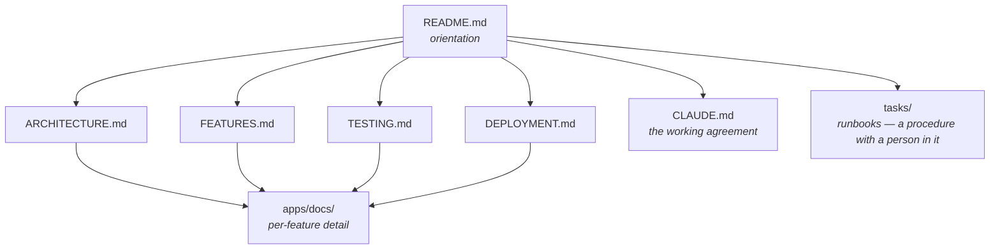

# `apps/docs` — product documentation

38 markdown pages: getting started, one page per engine package, feature guides,
deployment procedures and the Convex API reference.

**Not a workspace.** There is no `package.json` here and nothing builds it —
these are files you read in the repository or on GitHub. That is deliberate: a
documentation site is one more thing to deploy and one more thing to go stale
silently.

---

## Where to start

| Section | Answers |
| --- | --- |
| [`getting-started/`](./getting-started/introduction.md) | What the product is, how to install it, first steps |
| [`packages/`](./packages/) | One page per `@be-yours/*` package |
| [`guides/`](./guides/) | Feature-by-feature implementation guides |
| [`deployment/`](./deployment/) | GitHub Packages, Vercel, the S3 bucket policy, the Infisical store, AWS ownership |
| [`api-reference/`](./api-reference/) | Convex API and REST endpoints |

Two deployment pages are load-bearing and worth naming:

- [`deployment/infisical.md`](./deployment/infisical.md) — the secret store, the
  `infra-ci` machine identity, and the two UUIDs that are easy to confuse
- [`deployment/aws-ownership.md`](./deployment/aws-ownership.md) — why one AWS
  account per client is the decision but not yet the state of the fleet

---

## How this relates to the rest

| Layer | Holds | Lives in |
| --- | --- | --- |
| Orientation | What exists, and where | [`README.md`](../../README.md) |
| Measured state | What ships, what does not, what CI runs | `ARCHITECTURE` · `FEATURES` · `TESTING` · `DEPLOYMENT` |
| Detail | How one feature works | **here** |
| Procedure | A sequence with a human step in it | [`tasks/`](../../tasks) |

Each application also documents itself:
[`apps/site`](../site/README.md) · [`apps/reference`](../reference/README.md) ·
[`apps/themes`](../themes/README.md), and each engine package carries its own
README under [`packages/`](../../packages).

---

## The rule these pages are held to

Documentation is the one artefact in this repository that nothing executes, so
it is the one that rots without saying so. Two habits hold it:

**Measure, then date, then pin.** A count with no commit attached is not a
measurement. `pnpm check:claude-md` enforces exactly this for `CLAUDE.md` — it
fails when the file names a command that does not run or a document that does
not exist, and when its headline figure is pinned to a commit no longer in
history.

**Say where the product falls short.** A page that describes an unbuilt feature
as available costs more than a page that does not exist. Square is announced and
not implemented; ESC/POS printing is not implemented; RTL and currency do not
reach the storefront. Those sentences belong in the docs, not only in the issue
tracker.

---

## Tech stack, for orientation

- **Framework** — Next.js 16 (App Router), React 19
- **Backend** — Convex, one deployment per client
- **Styling** — Tailwind CSS v4 + shadcn/ui
- **State** — Zustand (client) + Convex hooks (server)
- **Auth** — Better Auth + Convex
- **Payments** — Stripe, SumUp, PayPal, cash. Square is announced, not built
- **Storage** — AWS S3 · **Email** — AWS SES, or Resend by `EMAIL_PROVIDER`
- **i18n** — GPT-3.5-turbo auto-translation of the catalogue
- **Monorepo** — pnpm + Turborepo · **Registry** — GitHub Packages, private

---

**License** — Private. All rights reserved.
