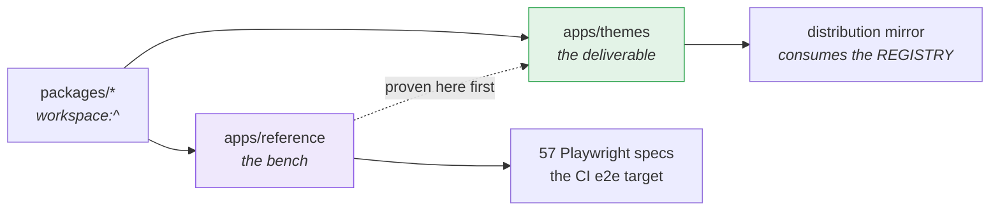

# `apps/reference` — the engine's reference application

All ten `@be-yours/*` packages wired together into an application that
runs: storefront, admin dashboard, CMS, kitchen display, QR games, i18n.

**It is sold to nobody.** It is the test bench: an engine feature is built here,
proven here, then shipped as a published package.

> Counts below were measured on **2026-09-10, at commit `f6c33c3`**.

---

## Why it exists

The packages are not runnable on their own. `admin` provides pages,
`convex-schema` provides tables, `ui` provides components — but none of that
starts. Something has to wire them together to see what you are writing.



Three roles:

| Role | In practice |
| --- | --- |
| **Test bench** | `pnpm dev:reference` runs the whole product from the engine sources, without publishing |
| **Type safety net** | Four packages — `admin`, `ui`, `convex-functions`, `convex-schema` — ship as raw TypeScript and have no `build` task. Their type errors only surface here |
| **E2E base** | The repository's CI e2e target. `ci.yml` runs this app's suite, not the template's |

Do not confuse it with `apps/themes`, which is the **deliverable**: the template
adds the client zone, the design templates, the site-creation scripts and the
sales demos.

> This section used to say *three* packages ship as raw TypeScript. `packages/ui`
> is the fourth — no `build` script, `main` at `./src/index.ts`. Corrected
> 2026-09-10.

---

## Size

| | |
| --- | --- |
| **Routes** | 109 page routes, 6 route handlers |
| **Engine packages consumed** | 9 of 10 — all but `mcp-server`, which is developer tooling |
| **Tests** | 156 Vitest files · 57 Playwright specs |

Surfaces, by route group:

| Route group | Contents |
| --- | --- |
| `(storefront)` | Menu, product, cart, checkout, account, orders, blog |
| `(admin)` | Dashboard, products, categories, orders, kitchen, inventory, customers, team, email, games, languages, CMS, subscription |
| `(auth)` | Sign in, sign up, forgotten password |
| `game/[qrCodeId]` | Gamification — table QR → social actions → game → prize |
| `display/[storeId]` | Kitchen display system |
| `preview/` | Preview of CMS pages and articles |

⚠️ **32 pages under `(admin)/` are redirects** to `/dashboard/*`:

```tsx
export default function Page() {
  redirect("/dashboard/products")
}
```

They are historical aliases kept so links do not break. Do not try to merge them
with the pages they point to.

---

## Getting started

From the monorepo root:

```bash
pnpm install
pnpm dev:reference
```

The Convex backend needs a second terminal, from this directory:

```bash
npx convex dev
```

Copy `.env.example` to `.env.local` first. A development Convex deployment is
enough — this app has a production deployment
(`optimistic-swordfish-937`), but nothing is sold from it.

⚠️ **With no `CONVEX_DEPLOYMENT` set, `npx convex dev` offers to create a *new
project*** and proposes a name derived from the package: `@beyours/reference` →
`beyours-reference`. That is how a stray project was created once.
`.env.example` says to pick the existing `beindigital-engine` instead.

---

## The 11 Deliveroo scenarios

They used to fall into a blind spot between the two runners: Vitest excluded
`**/e2e/**`, and the Playwright projects only match `*.spec.ts`. Written, never
executed.

They are **Vitest** suites — the exclude is now narrowed to
`**/e2e/**/*.spec.ts`, so `pnpm test` picks them up. Playwright is unaffected.

Most assertions are offline: they build a Deliveroo webhook payload and check its
shape. **13 tests need something live** and are gated, skipped by default:

| Gate | Requires | Covers |
| --- | --- | --- |
| `hasWebhookTarget` | `CONVEX_SITE_URL` **and** `DELIVEROO_WEBHOOK_SECRET` (or `DELIVEROO_CLIENT_SECRET`) | scenarios 2 and 8 — POST a signed webhook to a deployment |
| `hasDeliverooSandbox` | `DELIVEROO_CLIENT_ID`, `DELIVEROO_CLIENT_SECRET`, `DELIVEROO_BRAND_ID` | scenario 1 — calls the Deliveroo sandbox API |

`CONVEX_SITE_URL` is read straight from the environment for the gate, never
through `config`: the fallback there is a real deployment, and defaulting to it
would make every CI run fire signed payloads at a backend nobody asked for.

Three tests used to report green for nothing — two asserted
`expect(true).toBe(true)`, one held only comments. They now assert production
behaviour, and each was mutation-checked: breaking the corresponding rule makes
exactly that test fail.

| Test | Asserts |
| --- | --- |
| 401 retry | The client drops the cached token, mints a new one and replays the request **once**, carrying the fresh bearer |
| 500 passthrough | A 500 is returned untouched, with no retry and no token burned |
| OAuth failure | A failing token endpoint surfaces as `IntegrationError` with its status and platform |
| Cancellation | `mapDeliverooStatus` + `canTransitionTo` agree that a Deliveroo order cannot be cancelled once preparing, ready, or with a rider |

---

## Commands

From this directory, or via `pnpm --filter @beyours/reference <cmd>`:

| Command | Effect |
| --- | --- |
| `pnpm dev` | `next dev`, wrapped in the Infisical bootstrap (`--optional`) |
| `pnpm dev:plain` | `next dev` with no wrapper |
| `pnpm build` · `pnpm start` | Next.js |
| `pnpm lint` | ESLint |
| `pnpm type-check` | `tsc --noEmit` **twice** — the app, then `convex/tsconfig.json` |
| `pnpm test` · `pnpm test:watch` · `pnpm test:coverage` · `pnpm test:ui` | Vitest |
| `pnpm test:e2e` · `pnpm test:e2e:ui` · `pnpm test:e2e:debug` | Playwright |
| `pnpm ses:check` | Is this deployment out of the SES sandbox yet? |
| `pnpm clean` | Remove `.next` and `node_modules` |

The second `tsc` pass over `convex/tsconfig.json` is the **only** safety net
under `convex/`. The app's own pass does not cover it.

Local verification scripts, not wired to any task:

| Script | Answers |
| --- | --- |
| `scripts/local-ses.mjs` | A stubbed SES bench — the only way to exercise the send loop locally |
| `scripts/verify-campaign-send.mjs` | Does a campaign actually leave |
| `scripts/verify-resume-and-automation.mjs` | Do automations resume correctly |
| `scripts/verify-signup-journey.mjs` | The signup path end to end |
| `scripts/seed-users.mts` | Seed accounts |
| `scripts/kiosk-print.sh` | Chrome with `--kiosk-printing`, for the kitchen display |

---

## Relationship to the packages

Engine dependencies are declared `workspace:^`: this app always builds against
the **repository's current engine**, never against a published version. That is
intentional — it is what makes the effect of a change in `packages/` immediately
visible.

**The corollary is the important half:** what passes here does not prove the
published version will pass. The client template consumes the *published*
packages in its distribution mirror, and that is where a badly declared
`exports` or `files` field shows up. `pnpm check:mirror-build` is the check that
compiles the published shape.

### The twin relationship with `apps/themes`

The two apps are near-identical, deliberately. `pnpm check:divergence` fails on
any shared file that differs without a recorded decision in
[`tasks/reference-themes-divergence.md`](../../tasks/reference-themes-divergence.md).

⚠️ **A spec written only here runs in CI; a spec written only in `apps/themes`
does not.** `ci.yml`'s e2e target is this app. The template's suite runs on
pushes to `main`, in the eight-shard configuration — not on a pull request.

---

## Related documentation

- [`DESIGN_SYSTEM.md`](./DESIGN_SYSTEM.md) — the app's design system
- [`MISE_EN_PROD.md`](./MISE_EN_PROD.md) — inherited checklist, read with care
- [`e2e/README.md`](./e2e/README.md) · [`lib/README.md`](./lib/README.md) · [`convex/README.md`](./convex/README.md)
- [`../docs/`](../docs) — 38 pages of product documentation
- [Root README](../../README.md)
