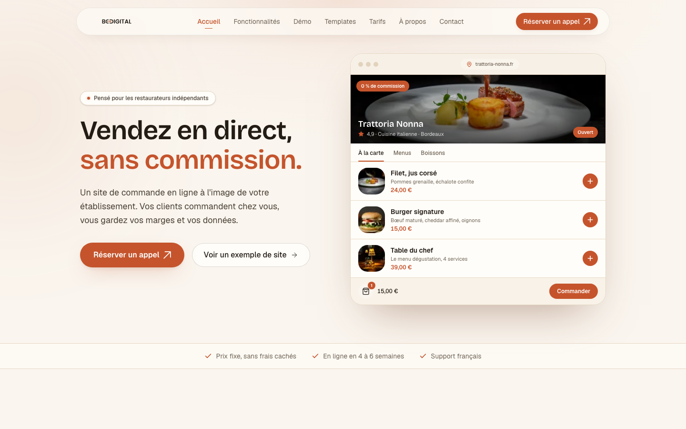
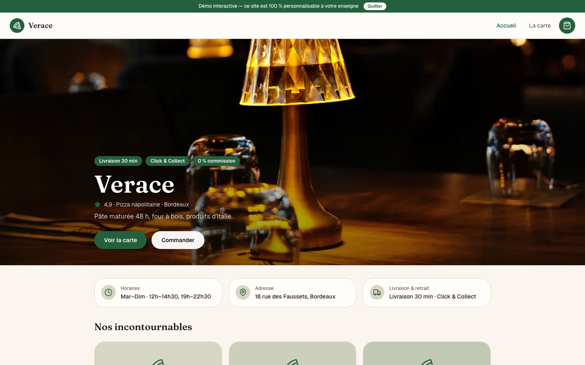

# `apps/site` — the BeYours commercial site

Marketing pages, a catalogue of 52 demoable templates, the Stripe checkout, the
affiliate portal and the internal operations console.

Next.js 16 (App Router) + Convex + Stripe + AWS SES.

**Live: https://beyours.fr**



> **BeYours is a product name, not a company.** The legal entity is
> **TUUM AGENCY SAS**, which operates the "Be in Digital" trade name. Legal
> notices, terms of sale, privacy policy and the affiliate contract all stay
> under that name — see [Brand and legal entity](#brand-and-legal-entity).

---

## In one minute

| | |
| --- | --- |
| **What it does** | Sells the BeYours offering and runs its operations |
| **What comes in** | Prospects on the marketing pages, affiliates on the portal |
| **What goes out** | Stripe orders, signed contracts, commissions, tracked incidents |
| **What sets it apart** | It depends on **no** `@be-in-digital/*` package — this is a website, not an instance of the product |
| **Size** | 37 routes · 119 components · 19 Convex tables · 3 crons · ~35,900 lines |

---

## Four audiences, one application

This is the peculiarity of this app, and the first thing to understand.

| Route | Audience | Pages | Contents |
| --- | --- | --- | --- |
| `(landing)` | Prospects | 14 | Home, features, pricing, catalogue, contact, checkout, legal pages |
| `(demo)` | Prospects | 1 | Interactive template demo, `demo/[slug]` |
| `parrainage` | External affiliates | 8 | Signup, signed contract, dashboard, sharing |
| `admin` | Internal team | 14 | Clients, fleet, incidents, monitoring, invoices, subscriptions, sales, prospects |

**Why the internal console is not a separate app.** It shares its identity
system with the affiliate portal: sign-in goes through `/parrainage/connexion`,
the table is `affiliateUsers`, and an administrator is nothing more than an
affiliate with `role: "admin"`. Splitting them would require a cross-domain
session for a benefit limited to blast radius.

Its 26 Convex functions **all** go through `requireAdmin`. Verified: 26 public
functions, 26 calls.

> Note on `(landing)`: the group also carries the Stripe checkout and the four
> legal pages. It is not a purely marketing surface.

---

## The template catalogue

52 templates across five verticals — pizzeria, fast food, food truck, chicken,
Asian — each with a presentation page and **a complete interactive demo** where
the visitor browses the menu and fills a cart.


Here a template is a data entry in `lib/templates-data.ts`:

```ts
{ slug, name, tagline, accent, accentDark, shot }
```

`lib/template-storefront.ts` combines that colour identity with the vertical's
mood — background tone, typeface, corner radius, menu, venue details — and
applies the whole thing at runtime through scoped CSS variables.



> ⚠️ **This demo storefront is a reimplementation.** It shares no code with
> `apps/themes`, the product actually shipped. A prospect therefore tries
> something other than what they buy, and the two drift apart with every
> change. This is the main open architectural issue in the repository.
>
> Worth noting: `apps/themes/demos/` already holds 50 browsable demos built
> from the real templates. Convergence probably goes through there.

---

## Brand and legal entity

Three levels, not to be confused:

| | |
| --- | --- |
| **BeYours** | Product name. Site title, `og:site_name`, marketing copy |
| **Be in Digital** | Registered trade name, operated by the company |
| **TUUM AGENCY SAS** | Legal entity — SIREN 930 817 697, RCS Paris |

Everything is centralised in `lib/legal/company.ts`. **Never duplicate that
information elsewhere**, and never run a global find-and-replace of
`Be in Digital` → `BeYours`: the affiliate contract
(`convex/contractContent.ts`) is legally built around the "Be in Digital" trade
name, its clause 5.2 forbids the affiliate from altering it, and **contracts are
already signed against that text**.

That is why the August 2026 BeYours rename swept the whole repository **except
this directory**.

VAT: French *franchise en base*, article 293 B of the CGI. No VAT charged; the
notice is read from `VAT.mention`. There is a ceiling (~€37,500 of revenue) — a
single large deal can cross it and trigger a retroactive switch to standard VAT.

---

## Getting started

From the monorepo root:

```bash
pnpm install
pnpm dev:site
```

The Convex backend needs a second terminal, from this directory:

```bash
npx convex dev
```

Copy `.env.production.example` to `.env.local` and fill it in before the first
run.

---

## Convex backend

`convex/` — 34 modules, 19 tables, 3 scheduled jobs, one HTTP webhook
(`POST /webhooks/stripe`). **Its own Convex deployment**, separate from the
agency's and from the clients'. Four domains:

**Affiliates** — `affiliateUsers`, `referralCodes`, `referrals`,
`affiliateSettings`. Signup, referral code, commission tracking.

**Contracts** — `contractVersions`, `contractSignatures`. Signing happens **in
the app, with no external provider**. Yousign was dropped (expired
subscription); the schema keeps some inherited optional fields, and
`MISE_EN_PROD.md` still mentions its variables — stale.

**Commerce** — `orders`, `payments`, `subscriptions`, `invoices`. Stripe and
Stripe Connect.

**Operations** — `saDeployments`, `saStores`, `saSalesSnapshots`, `saIncidents`,
`saIncidentUpdates`, `saMonitoringChecks`, `saActivity`. This is the internal
console: tracking the fleet of client sites, incidents, monitoring, revenue.

Multi-provider email in `convex/email/`: AWS SES by default, Resend as an
alternative, selected by `EMAIL_PROVIDER`.

---

## Environment variables

Full template in `.env.production.example`.

**Application** — `NEXT_PUBLIC_CONVEX_URL`, `NEXT_PUBLIC_CONVEX_SITE_URL`,
`NEXT_PUBLIC_SITE_URL`, `NEXT_PUBLIC_TVA_ENABLED`

**Set on the Convex deployment**, never in the repository —
`STRIPE_SECRET_KEY`, `STRIPE_WEBHOOK_SECRET`, `STRIPE_TAX_ENABLED`,
`AWS_ACCESS_KEY_ID`, `AWS_SECRET_ACCESS_KEY`, `AWS_REGION`,
`AWS_SES_FROM_EMAIL`, `EMAIL_PROVIDER`, `RESEND_API_KEY`, `BID_NOTIFY_EMAIL`,
`CALENDLY_URL`

`.gitignore` covers `.env*` except the templates. On an app that handles Stripe
in live mode, never relax that rule.

---

## Commands

From this directory, or via `pnpm --filter @beyours/site <cmd>` from the root:

| Command | Effect |
| --- | --- |
| `pnpm dev` | Development server |
| `pnpm build` | Production build |
| `pnpm lint` · `pnpm type-check` | Quality |
| `pnpm test` | 33 Vitest unit tests, 6 files |
| `pnpm test:e2e` | Playwright |
| `pnpm seed` | Demo dataset for the console |

---

## Fonts

All 7 families are **self-hosted** in `app/fonts/` through `next/font/local` —
9 files, 212 KB.

Four of them are the templates' accent typefaces: Fraunces for pizzeria, Anton
for fast food, Oswald for food truck, Zen Kaku for Asian.

**Do not go back to `next/font/google`.** That loader downloads the woff2 files
from `fonts.gstatic.com` at build time: seven families, so seven chances for a
Google outage to fail a deployment with no line of code having changed. It
happened to the agency site on 2026-08-15.

---

## Things to watch

**8 synchronous `setState` calls inside effects**, in `app/admin/`,
`components/admin/ui/` and the carousels. They trigger cascading renders.
Neutralised by an `eslint-plugin-react-hooks@7.0.1` override hoisted to the
monorepo root — 7.1.1 promotes them to errors. These are real signals worth
addressing.

**The logo still shows the old "B·IN·DIGITAL" wordmark** while the site
announces BeYours. `components/ui/logo.tsx` serves an image, not a string: it is
an asset to redraw. Drop the new SVG at `public/logo-ink.svg`; the
dark-background variant is the same file with three fills swapped.

**`MISE_EN_PROD.md`** documents `YOUSIGN_API_KEY` and `YOUSIGN_WEBHOOK_SECRET`
for a provider that was dropped.

---

## Deployment

Vercel project `beindigital-restaurant`, team `be-in-digital`. A push that
touches this app builds it alone: this directory's `vercel.json` carries
`ignoreCommand: npx turbo-ignore @beyours/site`.

Convex is pushed separately: `npx convex deploy` from this directory.

Details and checklist in [`MISE_EN_PROD.md`](./MISE_EN_PROD.md). The sales
process is described in [`PROCESS_DE_VENTE.md`](./PROCESS_DE_VENTE.md).

---

## Picking up this app

1. The [root README](../../README.md) for monorepo context, then this one, then
   [`DESIGN.md`](./DESIGN.md) for the art direction.
2. `lib/legal/company.ts` before any change touching the brand, the legal pages
   or the affiliate contract.
3. `lib/templates-data.ts` and `lib/template-storefront.ts` to understand the
   template system — the commercial core.
4. `convex/schema.ts` for the data model, 530 commented lines.
5. `pnpm dev:site` + `npx convex dev`, then `pnpm seed` to populate the console.

---

## History

This app lived under `apps/web-restaurant` in the `be-in-digital/beindigital`
monorepo. It moved out in August 2026 into a standalone `beyours` repository,
then came back as `apps/site` when the three BeYours projects were regrouped.
Its history followed at every step.

The three shared packages of the old monorepo were dissolved: `webgl-utils`
became `lib/webgl/`, `config` was inlined into `tsconfig.json`, and `tokens` was
dropped — it was declared as a dependency without being imported anywhere.
