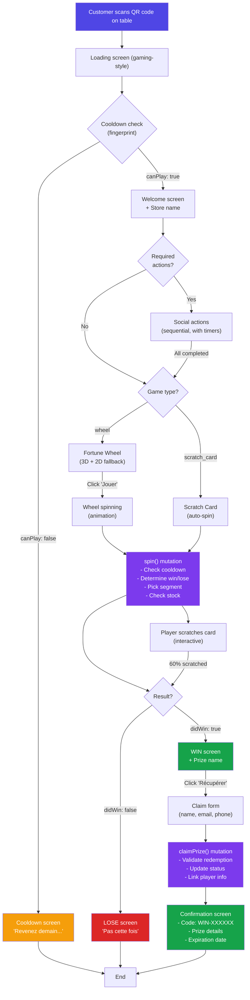
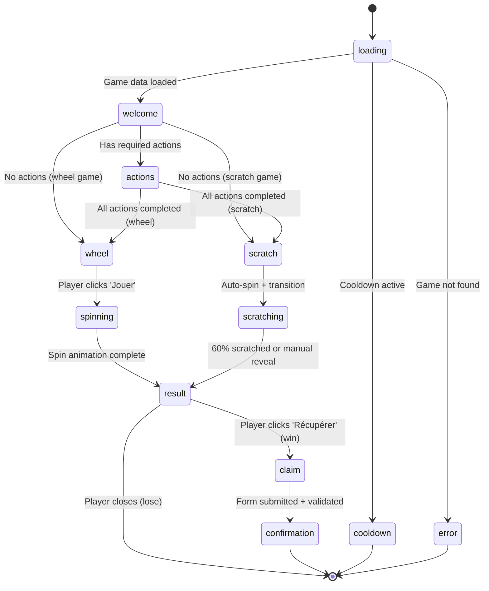
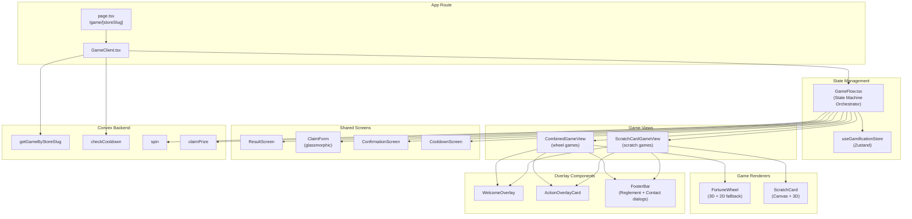
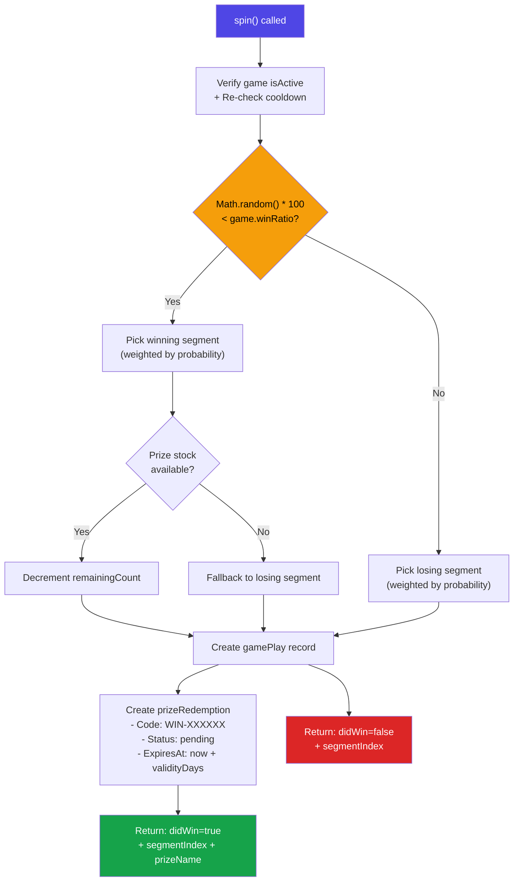

# Gamification System

## Overview

The gamification system allows restaurant customers to scan QR codes on tables, complete social actions (Google review, Instagram follow, etc.), and play games (Fortune Wheel or Scratch Card) to win prizes. The system uses a **global configuration** model where games, prizes, and actions are defined at the restaurant level, while gameplay tracking and QR codes remain per-store.

---

## Architecture

### Global vs Per-Store Data Model

| Layer | Scope | Tables |
|-------|-------|--------|
| **Configuration** | Global (restaurant) | `games`, `prizes`, `requiredActions` |
| **Tracking** | Per-store | `gamePlays`, `prizeRedemptions`, `gameQRCodes` |
| **Cooldown** | Global (fingerprint) | Checked via `gamePlays.by_fingerprint` index |

> **Why global config?** A restaurant owner configures games, prizes, and social actions once. All stores share the same setup. QR codes and gameplay analytics are tracked per-store for reporting.

### Tech Stack

| Layer | Technology |
|-------|-----------|
| State Machine | Zustand (`useGamificationStore`) |
| Backend | Convex (queries + mutations) |
| 3D Rendering | Three.js + React Three Fiber + Drei |
| Animations | Framer Motion |
| UI | Tailwind CSS + Glassmorphism |

---

## User Flow Diagram



---

## State Machine

The game flow is managed by a Zustand store with 12 possible states:



### State Definitions

| State | Description |
|-------|-------------|
| `loading` | Fetching game data and checking cooldown |
| `cooldown` | Player already played within cooldown period (24h default) |
| `welcome` | Welcome screen with store name and start button |
| `actions` | Sequential social action completion (one at a time with timer) |
| `wheel` | Fortune Wheel ready to spin |
| `spinning` | Wheel animation in progress |
| `scratch` | Scratch card auto-spin (internal, auto-transitions) |
| `scratching` | Player interactively scratching the card |
| `result` | Win/lose result display |
| `claim` | Prize claim form (name, email, phone) |
| `confirmation` | Redemption code + prize details |
| `error` | Error state with message |

---

## Component Architecture



---

## Database Schema

### Global Tables

#### `games`
```typescript
{
  type: "wheel" | "scratch_card",
  name: string,
  winRatio: number,           // 0-100, admin-controlled
  isActive: boolean,
  config: {
    wheelSections: [{
      label: string,
      color: string,
      probability: number,    // Relative weight
      prizeId?: Id<"prizes">,
      isWinning: boolean,
    }],
    primaryColor: string,
    secondaryColor: string,
    backgroundImage?: string,
    cooldownHours: number,    // Default: 24
  }
}
// Index: by_isActive
```

#### `requiredActions`
```typescript
{
  type: "google_review" | "instagram_follow" | "facebook_like" | "tiktok_follow" | "email_subscribe",
  name: string,
  url?: string,               // URL to open (Google profile, Instagram, etc.)
  isRequired: boolean,
  sortOrder: number,
  timerSeconds: number,       // Countdown after action click
  isActive: boolean,
}
// Index: by_isActive
```

#### `prizes`
```typescript
{
  name: string,
  type: "discount_percentage" | "discount_fixed" | "free_product" | "free_menu" | "custom",
  value?: number,
  validityDays: number,       // How long prize is redeemable
  totalAvailable?: number,
  remainingCount?: number,    // Inventory tracking (optional)
  isActive: boolean,
}
// Index: by_isActive
```

### Per-Store Tables

#### `gameQRCodes`
```typescript
{
  storeId: Id<"stores">,
  code: string,               // Unique QR value
  gameType?: "wheel" | "scratch_card",
  tableNumber?: string,
  isActive: boolean,
  scannedCount: number,
}
```

#### `gamePlays`
```typescript
{
  storeId: Id<"stores">,
  gameId: Id<"games">,
  fingerprint: string,        // Browser UUID for cooldown
  completedActions: string[],
  didWin: boolean,
  prizeId?: Id<"prizes">,
  playedAt: number,
}
// Indexes: by_fingerprint (global cooldown), by_storeId, by_playerEmail
```

#### `prizeRedemptions`
```typescript
{
  storeId: Id<"stores">,
  gamePlayId: Id<"gamePlays">,
  prizeId: Id<"prizes">,
  redemptionCode: string,     // "WIN-XXXXXX"
  status: "pending" | "claimed" | "redeemed" | "expired" | "cancelled",
  expiresAt: number,
}
// Indexes: by_redemptionCode, by_storeId_status
```

---

## Backend Functions

### Queries

| Function | Input | Output | Description |
|----------|-------|--------|-------------|
| `getGameByStoreSlug` | `storeSlug`, `gameType?` | `{store, game, sections, actions, settings}` | Fetch complete game config for a store |
| `checkCooldown` | `fingerprint`, `cooldownHours` | `{canPlay, nextPlayAt?}` | Check if player can play (global by fingerprint) |

### Mutations

| Function | Input | Output | Description |
|----------|-------|--------|-------------|
| `spin` | `gameId`, `storeId`, `fingerprint`, `completedActions` | `{didWin, segmentIndex, prizeName?, redemptionId?}` | Execute game play, determine win/lose, create records |
| `claimPrize` | `redemptionId`, `firstName`, `email`, `phone?` | `{redemptionCode, prizeName, expiresAt, email}` | Finalize prize claim with player info |

### Spin Logic



---

## Key Design Decisions

### 1. Global Fingerprint Cooldown
The cooldown is enforced **globally by browser fingerprint** (UUID in localStorage), not per-store. This prevents a customer from playing at Store A, then immediately playing at Store B.

### 2. Admin-Controlled Win Ratio
The `winRatio` (0-100%) is set by the admin on the game. The server determines win/lose **before** segment selection. This ensures the admin has full control over prize distribution.

### 3. Weighted Segment Selection
Each wheel segment has a `probability` (relative weight). After win/lose is determined, only matching segments (winning or losing) are considered. Selection uses weighted random:

```
totalWeight = sum(candidates.probability)
random = Math.random() * totalWeight
for each candidate: random -= probability → pick when random <= 0
```

### 4. Stock Management
Prize inventory (`remainingCount`) is decremented atomically during the spin mutation. If a winning segment's prize is out of stock, the result **falls back to a losing segment**.

### 5. Sequential Actions with Timers
Social actions are displayed one at a time. After clicking, a timer starts (e.g., 10 seconds). The timer ensures the customer actually visits the external link (Google review, Instagram, etc.) before completing the action.

### 6. 3D with Fallback
Both Fortune Wheel and Scratch Card use Three.js for 3D rendering. If WebGL is unavailable or context is lost, they fall back to 2D canvas rendering. The wheel has a retry mechanism (up to 3 remounts on context loss).

---

## File Structure

```
packages/
├── convex-schema/src/tables/gamification.ts    # Database schema
├── convex-functions/src/
│   ├── gamification/
│   │   ├── getGameByStoreSlug.ts               # Main query
│   │   ├── checkCooldown.ts                    # Cooldown query
│   │   ├── spin.ts                             # Spin mutation
│   │   ├── claimPrize.ts                       # Claim mutation
│   │   └── index.ts
│   ├── games.ts                                # CRUD for games
│   ├── prizes.ts                               # CRUD for prizes
│   ├── requiredActions.ts                      # CRUD for actions
│   ├── gamePlays.ts                            # Gameplay tracking
│   └── prizeRedemptions.ts                     # Redemption tracking
├── restaurant/src/
│   ├── gamification/
│   │   ├── GameFlow.tsx                        # State machine orchestrator
│   │   └── index.ts
│   └── stores/gamification.ts                  # Zustand store
├── ui/src/components/gamification/
│   ├── CombinedGameView.tsx                    # Wheel game view
│   ├── ScratchCardGameView.tsx                 # Scratch card view
│   ├── FortuneWheel.tsx                        # 3D wheel wrapper
│   ├── ScratchCard.tsx                         # Scratch card wrapper
│   ├── WelcomeOverlay.tsx                      # Welcome screen
│   ├── ActionOverlayCard.tsx                   # Social action card
│   ├── SocialActions.tsx                       # Actions list
│   ├── ResultScreen.tsx                        # Win/lose screen
│   ├── ClaimForm.tsx                           # Prize claim form
│   ├── ConfirmationScreen.tsx                  # Redemption code
│   ├── CooldownScreen.tsx                      # Cooldown message
│   ├── FooterBar.tsx                           # Footer with dialogs
│   ├── ErrorBoundary.tsx                       # Error handling
│   ├── fortune-wheel/                          # 3D wheel components
│   │   ├── FortuneWheel3D.tsx
│   │   ├── WheelSegment3D.tsx
│   │   ├── CenterHub.tsx
│   │   ├── Pointer3D.tsx
│   │   ├── WheelRim.tsx
│   │   └── WheelStand.tsx
│   ├── scratch-card/                           # 3D scratch card
│   │   ├── ScratchCard3D.tsx
│   │   ├── CardMesh.tsx
│   │   ├── ScratchLayer.tsx
│   │   └── ScratchParticles.tsx
│   ├── types.ts                                # Shared types
│   └── index.ts                                # Barrel exports
└── admin/src/pages/games/
    ├── games-dashboard-page.tsx                # Overview
    ├── games-catalog-page.tsx                  # Games & prizes CRUD
    ├── actions-page.tsx                        # Social actions CRUD
    ├── games-settings-page.tsx                 # Win ratio config
    ├── qr-codes-page.tsx                       # QR code management
    ├── winners-page.tsx                        # Winner tracking
    ├── game-form-dialog.tsx                    # Game creation dialog
    ├── action-form-dialog.tsx                  # Action creation dialog
    └── segment-editor.tsx                      # Wheel segment editor

apps/restaurant-theme/
├── app/game/[storeSlug]/
│   ├── page.tsx                                # Server component (SSR)
│   └── GameClient.tsx                          # Client component
├── convex/
│   ├── gamification.ts                         # Local Convex functions
│   ├── gamePlays.ts
│   ├── prizeRedemptions.ts
│   └── requiredActions.ts
└── e2e/
    ├── gamification.spec.ts                    # E2E tests
    └── admin-gamification.spec.ts              # Admin E2E tests
```

---

## URL Parameters

| Parameter | Values | Description |
|-----------|--------|-------------|
| `storeSlug` | Route param | Store identifier |
| `game` | `wheel`, `scratch_card` | Force specific game type |
| `dev` | `true` | Dev mode: fresh fingerprint, bypasses cooldown |

**Example URLs:**
- `/game/paris-bastille` — Default game for Paris Bastille store
- `/game/paris-bastille?game=scratch_card` — Force scratch card
- `/game/paris-bastille?dev=true` — Dev mode (no cooldown)

---

## Error Handling

| Scenario | Behavior |
|----------|----------|
| Game not found | Error screen: "Jeu introuvable ou inactif" |
| Cooldown active | Cooldown screen with countdown timer |
| No wheel sections | Error: "No wheel sections configured" |
| Prize out of stock | Fallback to losing segment (transparent to player) |
| Prize expired during claim | Error: "Prize has expired" |
| Already claimed | Error: "Prize already claimed or expired" |
| WebGL context loss | Auto-remount 3D component (up to 3 retries) |
| Network error | Error screen with generic message |
